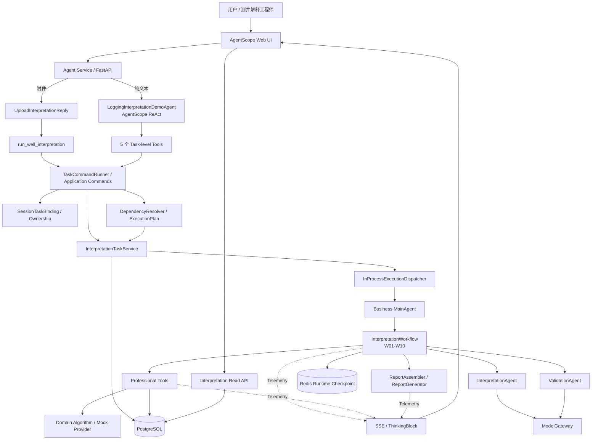

# 测井解释智能体总体技术架构（Current Design）

## 1. 文档目的

本文档描述当前已经实现并作为后续开发基线的总体技术架构。

当前行为以以下事实来源为准：

1. 当前分支代码；
2. Alembic migration；
3. 本文档及 `docs/README.md` 标记为 **Current Design** 的设计文档。

详细设计分别见：

- [01-business-workflow.md](01-business-workflow.md)：W01～W10 业务主线；
- [02-agent-tool-boundary.md](02-agent-tool-boundary.md)：Agent、Workflow、Tool 与专业算法边界；
- [04-interactive-agent-architecture.md](04-interactive-agent-architecture.md)：交互式 Agent 总体架构；
- [05-interactive-agent-detailed-design.md](05-interactive-agent-detailed-design.md)：Task、Execution、规划与 E2E 设计；
- [05-persistence.md](05-persistence.md)：PostgreSQL / Redis 运行时持久化；
- [07-database-design.md](07-database-design.md)：数据库实体、版本和并发控制；
- [08-intent-and-interaction-design.md](08-intent-and-interaction-design.md)：意图识别与任务级 Tool；
- [09-streaming-progress-and-ui-design.md](09-streaming-progress-and-ui-design.md)：解释过程 SSE 与前端职责。

`06-interactive-agent-gap-analysis.md` 是历史差距分析，不作为当前能力事实来源。

---

## 2. 核心架构结论

当前系统采用：

> **ReAct for Interaction，Workflow for Execution。**

职责边界如下：

```text
AgentScope ReAct
负责理解用户自然语言、提取受支持参数、选择任务级 Tool

Application
负责身份归属、参数校验、版本创建、执行计划和读模型

MainAgent
负责业务编排

InterpretationWorkflow
负责 W01～W10 的确定性执行顺序

Professional Tool / Domain Algorithm
负责具体专业执行

PostgreSQL
负责长期、可追溯的业务事实

Redis
负责可丢弃运行快照和 AgentScope Session / Message

Telemetry
负责 Workflow / Tool / Report 实时过程事件
```

核心原则：

- LLM 可以理解“用户想做什么”，但不能决定专业步骤依赖和失效范围；
- Workflow 负责专业主线，不能由 Prompt 临时改写顺序；
- 每次真正执行生成新的 Execution，历史结果不覆盖；
- PostgreSQL 是 canonical source，Redis 和进程内对象都不是业务事实唯一来源；
- 后台 Execution 与当前浏览器 SSE 生命周期解耦；
- Mock、Real、Virtual、Derived Tool 共用正式 Contract 和审计边界。

---

## 3. 技术基线

| 类别 | 当前技术 |
| --- | --- |
| 开发语言 | Python 3.11 |
| Agent Framework | AgentScope 2.x |
| Web / Agent Service | AgentScope Web UI + Agent Service |
| API | AgentScope Service / FastAPI |
| Schema | Pydantic |
| 数据库 | PostgreSQL |
| ORM | SQLAlchemy 2.x async |
| Migration | Alembic |
| Runtime / Session | Redis |
| 配置 | pydantic-settings |
| 测试 | pytest |
| 代码检查 | ruff |
| 类型检查 | mypy |
| Telemetry | 项目 Telemetry 抽象，可接 OpenTelemetry |
| 外层交互模型 | qwen-plus（openai-compatible）或本地 Mock Shell |
| 专业模型访问 | ModelGateway；未来扩展独立 Prediction Provider |

当前开发和 Demo 阶段优先使用 Docker Compose 提供 PostgreSQL / Redis，本地运行 Agent Service 与 Web UI。

---

## 4. 总体架构



这张图有两个必须长期保持的边界：

1. `LoggingInterpretationDemoAgent` 是真正的 Web ReAct Agent；
2. `agents/main_agent.py::MainAgent` 是业务 Planner / Orchestrator，不承担 Web 自然语言意图识别。

---

## 5. Interface 与交互层

当前对外入口主要包括：

- AgentScope Web UI；
- AgentScope Chat / Session / SSE；
- Interpretation Read API；
- CLI / Dev Runner。

Web 的主要职责：

- 自然语言交互；
- 上传井资料；
- 展示当前解释过程；
- 查看当前 / 历史 Execution；
- 查看 W01～W10、ToolRun、Override 和报告；
- 后续为测井曲线、解释层段和图形化结果保留展示区域。

当前右侧 Interpretation Panel 已展示结构化 Execution 事实。曲线绘图尚未实现，详细边界见 [09-streaming-progress-and-ui-design.md](09-streaming-progress-and-ui-design.md)。

---

## 6. Agent 层

### 6.1 LoggingInterpretationDemoAgent

`LoggingInterpretationDemoAgent` 是当前 Web 外层 AgentScope ReAct Agent。

职责：

```text
理解纯文本请求
↓
从可信上下文获取 task_id
↓
选择受限 Task-level Tool
↓
提取并结构化受支持参数
↓
根据 ToolResult 组织用户回复
```

它不负责：

- W01～W10 排序；
- 判断哪些步骤需要失效；
- 直接写 PostgreSQL；
- 直接调用底层专业 Tool；
- 生成不存在的专业数据。

含附件的首次上传由 `UploadInterpretationReply` 做确定性路由，不把上传井资料交给 qwen-plus 判断。

### 6.2 MainAgent

业务 `MainAgent` 当前定位是：

```text
Business Planner
+
Orchestrator
```

职责：

```text
接收已经确定的业务执行请求 / State
↓
按照受控 start_step 启动 InterpretationWorkflow
↓
协调业务 Agent / Tool
↓
返回结构化 InterpretationState
```

`MainAgent` **不负责**：

- Web 用户意图识别；
- 决定当前用户是在查状态还是改参数；
- 从聊天文本猜 task_id；
- 自由生成 W01～W10 顺序。

### 6.3 InterpretationAgent / ValidationAgent

当前业务职责保持在 Workflow 内：

- `InterpretationAgent`：承担现有 W06 / W07 中需要模型参与的专业解释；
- `ValidationAgent`：承担 W09 的综合验证职责。

它们都不是外层交互 Agent。

---

## 7. 任务级 Action Space

纯文本 ReAct 当前只能选择以下任务级 Tool：

```text
run_well_interpretation
modify_well_interpretation
rerun_well_interpretation
get_interpretation_status
get_interpretation_report
```

典型链路：

```text
“把孔隙度、渗透率改成 0.16”
↓
AgentScope ReAct
↓
modify_well_interpretation
↓
Pydantic / Session Ownership 校验
↓
DependencyResolver
↓
新 Execution
```

专业底层 Tool，例如 `calculate_sw`、`identify_lithology`，不暴露给外层 ReAct 直接调用。

详细规则见 [08-intent-and-interaction-design.md](08-intent-and-interaction-design.md)。

---

## 8. Application Layer

Application Layer 当前负责：

- Task / Execution 生命周期；
- InputVersion 与 Override；
- Session ↔ Task ownership；
- Command 参数校验；
- ExecutionPlan；
- RUN / REUSE 规划；
- 后台 Execution 提交；
- Execution / ToolRun / Report 读模型；
- 持久化协调与稳定错误码。

核心实现包括：

```text
InterpretationTaskService
TaskCommandRunner
TaskCommands
DependencyResolver
StateReuseAssembler
InProcessExecutionDispatcher
```

Application Layer 不实现测井算法。

---

## 9. Workflow 与专业主线

当前 `InterpretationWorkflow` 保持 W01～W10 的确定性顺序：

```text
W01 获取井资料
↓
W02 数据完整性检查
↓
W03 曲线质量检查
↓
W04 岩性识别
↓
W05 储层识别与物性评价
↓
W06 流体识别
↓
W07 油气水层分类
↓
W08 层段划分与有效厚度
↓
W09 综合验证
↓
W10 最终一致性检查
↓
Report
```

交互层不会修改这条主线。

当前局部重跑只允许受控边界：

| 变化 | 当前执行策略 |
| --- | --- |
| 首次解释 / 全量重跑 / 新输入 | W01～W10 RUN |
| sampling_interval | W01 REUSE；W02～W10 RUN |
| por / perm / prediction_model | W01～W03 REUSE；W04～W10 RUN |
| 无需专业重算 | 可复用结果，仅重新生成报告 |

当前没有 arbitrary step rerun，也没有 SW-only 重算。

---

## 10. Retry、Rollback 与 Review 边界

### 10.1 当前实现

当前系统**没有**一套通用的：

```text
MAX_TOOL_RETRY
MAX_MODEL_RETRY
MAX_WORKFLOW_ROLLBACK
```

自动循环机制，也没有“W09 检测冲突后自动跳回 W06 再执行”的实现。

现有 Tool、Model、Persistence 或业务步骤失败时，由当前错误边界记录状态、错误码和 Execution 终态；需要人工判断时进入现有 Review / Blocked 语义，而不是在同一个 Execution 内自由回退专业步骤。

### 10.2 Future

未来如果第三方 Heavy API 的协议确认需要重试，应在 Provider / Execution 层定义：

- 哪些错误可重试；
- 幂等键；
- 最大次数；
- 是否产生外部副作用；
- 重试是否创建新的物理调用记录。

未来如果确实需要“业务回退重新解释”，优先采用**新的 Execution + 明确依赖计划**，而不是在当前 Workflow 中加入不可审计循环。

---

## 11. Tool Layer

Tool 是 Workflow / 专业 Agent 与具体执行能力之间的正式边界：

```text
Workflow / Professional Agent
↓
Tool Contract
↓
ToolCaller
↓
Tool Implementation
↓
Domain Algorithm / External Provider
```

当前 Tool Contract 包含：

- `ToolInput`；
- `ToolOutput`；
- status；
- data；
- warnings；
- errors；
- metadata。

当前可持久化和可视化的专业 ToolRun 主要包括：

```text
get_well_data
check_curve_quality
identify_lithology
evaluate_petrophysics
calculate_sw
merge_intervals
```

Tool execution mode 支持：

```text
MOCK
REAL
VIRTUAL
DERIVED
```

当前专业结果仍以 Mock / Demo 为主，Heavy Prediction API 尚未接入。

---

## 12. Domain 与 State

Domain 层尽量与 AgentScope、FastAPI、Redis 和 PostgreSQL 解耦。

`InterpretationState` 是一次 Execution 的统一业务快照，包含输入、W01～W10 中间结果、状态、告警、错误、缺失资料和最终检查等信息。

当前策略：

```text
稳定的运行 / 版本 / 审计事实
→ PostgreSQL 关系字段

仍在持续演进的专业解释结果
→ InterpretationState JSONB snapshot
```

这样避免在正式井数据 Schema 尚未冻结前过早拆分大量专业结果表。

---

## 13. PostgreSQL 持久化

PostgreSQL 是业务事实 canonical source。

当前核心实体：

```text
interpretation_task
interpretation_input_version
interpretation_execution
interpretation_tool_run
interpretation_session_task_binding
```

关键原则：

- Task 表示持续工作对象；
- InputVersion 保存规范化输入版本；
- Execution 表示一次真正执行；
- ToolRun 记录专业工具轨迹；
- SessionTaskBinding 记录用户 / Agent / Session 对 Task 的 durable ownership；
- 报告当前与 Execution 同版本存储在 `interpretation_execution.markdown`；
- 历史版本追加保存，不覆盖。

详细字段和 migration 见 [07-database-design.md](07-database-design.md)。

---

## 14. Redis 边界

Redis 当前主要承担：

- `InterpretationState` 运行快照；
- AgentScope Session；
- AgentScope Message；
- 服务凭证等运行时数据。

原则：

> Redis 可丢；PostgreSQL 业务事实不可丢。

进程内的 runner、`observed_task_ids` 和 dispatcher Task 也都不是 durable truth。

---

## 15. 后台 Execution 与 Lease

任务级写操作先创建：

```text
Execution = QUEUED
```

然后提交 `InProcessExecutionDispatcher`。

Worker 生命周期：

```text
QUEUED
↓ claim
RUNNING
↓ heartbeat / lease renew
SUCCESS / WARNING / FAILED / BLOCKED / REVIEW_REQUIRED
```

同一 Task 通过数据库行锁、`expected_current_execution_id` 和活跃 Execution 检查避免并发覆盖。

Worker 失联时通过 lease expiry 标记为失败；当前不会自动重新执行可能具有外部副作用的 Workflow。

---

## 16. Session 与重启恢复

Migration `0006` 已实现 durable SessionTaskBinding：

```text
(user_id, agent_id, session_id, task_id)
```

Backend 重启后：

```text
runner cache = empty
↓
get_or_restore_runner()
↓
查询 PostgreSQL SessionTaskBinding
↓
恢复 Task ownership
↓
Read API / ReAct 可以继续访问原 Task
```

不能因为 PostgreSQL 中存在 task_id 就直接授权。

---

## 17. 流式解释过程

首次上传当前采用：

```text
上传并校验井资料
↓
run_well_interpretation
↓
ToolResultEnd(QUEUED)
↓
后台 Worker 继续运行
↓
同一 Reply 持续消费真实 Telemetry
↓
W01～W10 / Tool / Report 过程
↓
读取本 execution_id 的 Markdown
↓
ReplyEnd
```

`ToolResultEnd(QUEUED)` 只表示 Execution 已提交，不表示单井解释结束。

SSE 断开不会取消后台 Worker。重新打开页面通过 PostgreSQL、SessionTaskBinding 和 Read API 恢复持久状态；当前不 replay 已错过的 SSE Thinking delta。

详细见 [09-streaming-progress-and-ui-design.md](09-streaming-progress-and-ui-design.md)。

---

## 18. Read Model 与前端

当前右侧 Interpretation Panel 从 Read API 展示：

- 当前 / 历史 Execution；
- 四阶段 RUN / REUSE；
- W01～W10；
- ToolRun；
- Override；
- 报告；
- 历史版本。

聊天区负责当前自然语言交互和首次解释实时过程。

未来右侧可能扩展：

```text
GR / RT / DEN / CNL / AC / SP / CAL 曲线
深度轨迹
解释层段
储层区间
岩性 / 流体结果
有效厚度
解释成果绘图
```

当前尚未冻结绘图数据 Contract，也未选择具体绘图库。

---

## 19. Model 与 Provider 边界

需要区分三类概念：

### 19.1 外层交互模型

真实交互模式：

```text
AgentScope ReAct
+
qwen-plus
```

负责语义意图和任务级 Tool 选择。

`MockTaskShellModel` 只用于离线联调，不是生产 IntentClassifier。

### 19.2 Workflow 内专业模型

现有业务 Agent 通过 `ModelGateway` 获取模型能力。

### 19.3 Future Heavy Prediction Provider

未来第三方专业预测 API 应通过独立 Prediction Provider / Gateway 适配。

`prediction_model` 表示专业预测模型选择，不等于替换外层 qwen-plus。

---

## 20. Report Layer

当前报告由：

```text
InterpretationState
↓
ReportAssembler / ReportGenerator
↓
Markdown
```

生成，并绑定到具体 Execution。

报告正文和执行过程分离：

- ThinkingBlock：W01～W10、Tool、Report 生成过程；
- TextBlock：最终 Markdown Report。

当前没有独立 Report API，也没有独立 Report 表。未来只有在报告具备审批、人工编辑、签名、发布或独立制品生命周期后再拆分。

---

## 21. Telemetry 与可观测性

当前 Workflow / Tool / Report 通过项目 Telemetry 抽象产生事件。

核心事件包括：

```text
workflow.step.start
state.change
workflow.step.error
workflow.result

tool.start
tool.result
tool.error
tool.end

report.start
report.end
report.error
```

`ExecutionProgressProjector` 只把这些事实投影为用户可见过程，不参与业务决策。

日志和 Telemetry 都不能输出 API Key、Token、完整连接串或未脱敏异常内容。

---

## 22. 配置与安全边界

当前基础要求：

- API Key / 数据库密码不进入仓库；
- Token 和连接串不进入用户可见异常；
- Agent 不执行任意 SQL；
- 外层 ReAct 只能调用白名单任务级 Tool；
- 专业 Tool 输入输出按安全 Snapshot 规则审计；
- 用户 / Agent / Session / Task ownership 必须由服务端校验。

配置统一通过 pydantic-settings 和环境变量管理。

---

## 23. 部署与横向扩展边界

当前 Demo / 验证阶段采用：

```text
AgentScope Web UI
+
Agent Service
+
PostgreSQL
+
Redis
```

开发环境可使用 Docker Compose 启动 PostgreSQL / Redis。

当前后台执行仍是 **in-process dispatcher**，因此还不是完整分布式 Worker 架构。

已经为未来横向扩展保留的重要边界：

- 业务事实进入 PostgreSQL；
- Session / runtime 与实例逻辑分离；
- Execution 有 lease；
- Tool / Model / Provider 有明确接口；
- Task ownership 不依赖单进程缓存。

---

## 24. 当前能力与 Future

| 能力 | 状态 |
| --- | --- |
| AgentScope ReAct 交互 | Current |
| 附件确定性上传路由 | Current |
| Versioned Task / Input / Execution / Report | Current |
| POR / PERM / sampling / prediction_model Override | Current |
| W01/W02/W04/report boundary partial rerun | Current |
| Durable ToolRun | Current |
| Background Execution + Lease | Current |
| SessionTaskBinding restart recovery | Current |
| Interpretation Read API / History | Current |
| First-run streaming to final report | Current |
| qwen-plus 外层 ReAct | Current |
| Heavy Prediction API | Future |
| Real Report API | Future |
| SW-only / arbitrary step rerun | Future |
| CapabilityRegistry / fine-grained dependency graph | Future |
| Pause / resume | Future |
| Curve data contract / visualization | Future |
| Distributed task queue / cross-process Worker takeover | Future |

Future 能力不能通过 Prompt 或 UI 条件分支伪装成已经支持。

---

## 25. 历史 V0.1 基线说明

仓库早期版本的本文件曾记录以下探索性设计：

- “MainAgent 直接理解用户请求”的早期职责；
- `W09 → W06` 自动 rollback；
- 通用 `MAX_*_RETRY / ROLLBACK`；
- 候选数据库表（well、workflow_execution、report 等）；
- AgentScope Pipeline 候选实现；
- 第一轮 Skeleton / Codex 建设顺序；
- 早期目录结构建议。

这些内容属于项目启动阶段的 **Historical Baseline**，不是当前实现。

当前开发人员应以本文前 24 节和 `docs/README.md` 中的 Current Design 文档为准；如需了解历史演进，可查看 Git 历史和 [06-interactive-agent-gap-analysis.md](06-interactive-agent-gap-analysis.md)。

---

## 26. 当前核心调用链

首次上传：

```text
AgentScope Web
↓
Agent Service
↓
UploadInterpretationReply
↓
run_well_interpretation
↓
TaskCommandRunner
↓
InterpretationTaskService
↓
Execution QUEUED
↓
InProcessExecutionDispatcher
↓
Business MainAgent
↓
InterpretationWorkflow
↓
W01 → W10
↓
Professional Tool / ModelGateway
↓
ReportAssembler
↓
Execution Markdown
↓
SSE Final Report
```

纯文本修改：

```text
AgentScope Web
↓
LoggingInterpretationDemoAgent
↓
qwen-plus ReAct
↓
modify_well_interpretation
↓
Pydantic + Session Ownership
↓
DependencyResolver / ExecutionPlan
↓
new Execution
↓
RUN / REUSE
↓
Workflow / Report
```

查询状态和历史：

```text
Web Panel
↓
Read API
↓
PostgreSQL
↓
Task / Execution / ToolRun / Report
```

---

## 27. 架构总结

当前系统的核心不是“让大模型自由解释一口井”，而是：

```text
受约束自然语言交互
+
确定性业务流程
+
版本化 Execution
+
专业 Tool / Model 能力
+
可追溯持久化
+
实时过程展示
```

最终边界保持：

> **Agent 理解意图，Application 决定可执行动作与依赖，Workflow 控制专业流程，Tool 执行能力，PostgreSQL 保存事实。**
