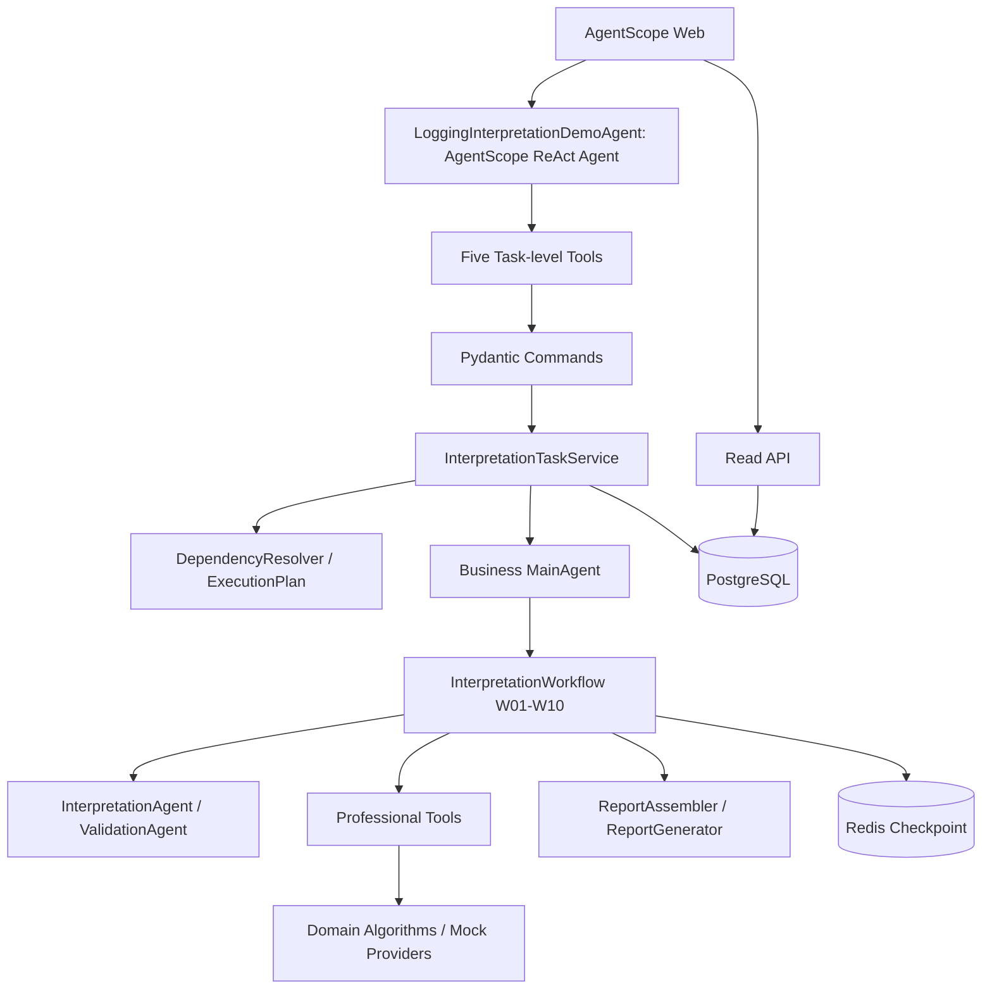

# 交互式测井解释智能体整体架构设计

## 1. 当前架构结论

系统采用 **ReAct for Interaction，Workflow for Execution**：AgentScope ReAct 负责理解自然语言并调用受限的任务级 Tool；业务 `MainAgent` 负责规划和编排现有 `InterpretationWorkflow`；Workflow 固定控制 W01～W10；专业 Tool 执行确定性或 Mock 算法；模型不决定步骤顺序或重跑起点。

当前已实现 Task / Execution 版本化、InputVersion、Override、确定性 ExecutionPlan、阶段边界局部重跑、ToolRun、五个交互命令、后台执行、Read API、Session Binding、Execution 可视化以及首次上传持续到最终报告的 SSE。Heavy Prediction API、曲线可视化和步骤级能力图仍是 Future。

## 2. 总体架构



`LoggingInterpretationDemoAgent` 是 Web 入口的 AgentScope ReAct Agent；`agents/main_agent.py::MainAgent` 是业务 Planner + Orchestrator。两者不是同一个角色，也不应合并描述。

## 3. 分层职责

| 层 | 当前职责 |
| --- | --- |
| Web / Interaction | 上传、自然语言、SSE、历史与 Interpretation Panel |
| AgentScope ReAct | 语义意图、参数提取、五个任务级 Tool 选择 |
| Application | Command 校验、ownership、规划、提交、查询和读模型 |
| Business Agent / Workflow | MainAgent 启动并协调 W01～W10；Workflow 控制状态、错误和步骤顺序 |
| Professional Tool / Algorithm | 单一 Contract、专业执行、ToolRun 轨迹；确定性计算不交给 LLM |
| Report | 按 Execution 结果生成 Markdown |
| Persistence | PostgreSQL durable facts；Redis 可丢弃检查点和 AgentScope 会话 |

## 4. 交互闭环

首次附件由确定性上传中间件解析，不进入 qwen-plus 上下文。它创建 InputVersion 和首个 Execution，绑定 Session 后提交 Worker，并在同一 SSE 回复中展示 W01～W10 和报告。纯文本请求由 ReAct 从以下 Tool 中选择：

- `run_well_interpretation`
- `modify_well_interpretation`
- `rerun_well_interpretation`
- `get_interpretation_status`
- `get_interpretation_report`

详细意图规则见 [08-intent-and-interaction-design.md](08-intent-and-interaction-design.md)。任务级 Tool 不直接替代 `identify_lithology`、`calculate_sw` 等专业 Tool；它们只能通过应用服务启动或查询业务执行。

## 5. Task、Execution 与输入版本

Task 表示一口井的持续工作，Execution 表示一次完整或局部执行，InputVersion 表示一份已校验的规范化输入。每次执行固化输入引用、Override、执行起点、来源、规划原因、状态快照和报告。历史版本追加保存。

当前 Override 字段只有 `sampling_interval`、`por`、`perm` 和 `prediction_model`。ExecutionPlan 是应用层只读计划对象，包含四个 Planner View：

| Planner View | 步骤 |
| --- | --- |
| DATA_DECODE | W01 |
| PREPROCESS | W02～W03 |
| INTERPRET | W04～W10 |
| REPORT | W10 后的报告装配与生成 |

四阶段用于规划、RUN/REUSE 和 UI 聚合，不是平行 Workflow，也没有独立 StageRun 表。局部重跑只允许从 W01、W02、W04 或报告边界开始。详细数据设计见 [07-database-design.md](07-database-design.md)，执行规则见 [05-interactive-agent-detailed-design.md](05-interactive-agent-detailed-design.md)。

## 6. 后台执行和可恢复边界

命令创建 `QUEUED` Execution 后立即提交 in-process dispatcher。Worker claim、续租并写唯一终态；Task 行锁、预期当前执行 ID 和 `TASK_EXECUTION_ACTIVE` 防止同一 Task 并发覆盖。过期租约标记为 FAILED，不自动重放 Workflow。

SessionTaskBinding 已由 migration `0006` 落库。Backend 重启时从 PostgreSQL 恢复 ownership；右侧面板通过只读 API 查询 Task、Execution、ToolRun 和报告。Redis 与进程内集合都不是任务归属的 canonical source。

## 7. 流式进度和读模型

首次上传先发 `ToolResultEnd(QUEUED)`，再继续消费真实 Workflow、Tool 和 Report Telemetry，最终读取同一 Execution 的 Markdown 并发送 `ReplyEnd`。SSE 断开不取消后台 Worker；重新打开通过 Binding + Read API 恢复持久事实，当前不 replay SSE。

四阶段、步骤进度、ToolRun 统计和历史版本都属于 Read Model / Planner View。它们投影持久事实，不反向驱动 Workflow。完整事件与 UI 边界见 [09-streaming-progress-and-ui-design.md](09-streaming-progress-and-ui-design.md)。

## 8. Logical Tool 与 Provider

当前六个可视化专业 ToolRun 是 `get_well_data`、`check_curve_quality`、`identify_lithology`、`evaluate_petrophysics`、`calculate_sw`、`merge_intervals`。Mock 必须实现正式 Tool Contract 和输出 Schema；`execution_mode` 明确记录 `MOCK / REAL / VIRTUAL / DERIVED`。

Heavy Prediction API 当前未接入。未来应通过独立 PredictionProvider / Gateway 适配，把外部综合调用投影为受审计的 ToolRun；`prediction_model` 表示专业预测模型选择，不等于替换外层 qwen-plus。当前也没有真实 Report API。

## 9. 当前与 Future

| 能力 | 状态 |
| --- | --- |
| Versioned Task / Input / Execution / Report | Current |
| Partial Rerun at W01/W02/W04/report boundary | Current |
| Durable ToolRun and Session Binding | Current |
| Background lifecycle, lease and Read API | Current |
| Execution Panel and first-run streaming | Current |
| Heavy Prediction API / Report API | Future |
| SW-only or arbitrary step rerun | Future |
| Capability Registry / Dependency Graph | Future |
| Curve data contract and visualization | Future |
| Pause / resume | Future |

Future 能力不得通过 Prompt 或临时分支绕过当前 Workflow、Tool Contract、版本和审计边界。

## 10. 验收主链

一期交互主链已经形成：

```text
自然语言或附件
→ 确定性路由 / ReAct 意图
→ Task-level Tool
→ 新 Execution 与确定性 ExecutionPlan
→ W01-W10 完整或局部执行
→ ToolRun 与状态持久化
→ SSE / Read Model 展示
→ 本 Execution 的 Markdown 报告
```

历史差距和实施顺序见 [06-interactive-agent-gap-analysis.md](06-interactive-agent-gap-analysis.md)，该文档是 Historical Gap Analysis，不再作为当前能力事实来源。
