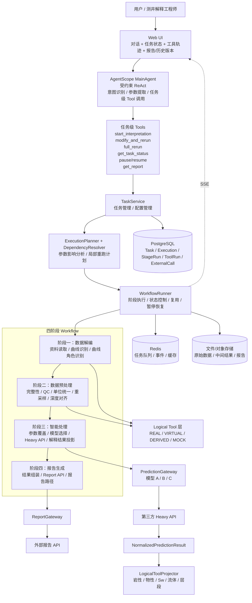

# 交互式测井解释智能体整体架构设计文档

> 基于 AgentScope 的可交互、可追溯、可局部重跑测井解释平台

| **项目** | 测井解释智能体                |
|----------|-------------------------------|
| **版本** | v1.0                          |
| **日期** | 2026-09-24                    |
| **目标** | 10月底形成可测试、可验证 Demo |
| **团队** | 2名开发 + 1名测试             |

# 1. 文档目的与设计结论

本文档用于固化交互式测井解释智能体的一期整体架构。当前优先目标不是一次性实现全部专业算法，而是先完成一个真实可交互的执行闭环：用户通过自然语言提出解释、参数修改或重跑请求，系统识别意图、生成执行计划、展示阶段与工具调用过程、产出对应的新解释结果和报告，并保留历史版本用于验证。

> **核心架构结论：**采用“ReAct for Interaction，Workflow for Execution”的混合范式：AgentScope MainAgent 负责意图理解、参数提取与任务级工具调用；确定性 Workflow 负责四阶段业务执行、局部重跑、结果复用和状态推进。


## 1.1 一期核心目标

- 支持自然语言发起完整测井解释任务。

- 支持自然语言修改采样间隔、预测模型、POR/PERM 等解释条件并重新解释。

- 根据参数影响范围自动决定全量重跑或从受影响阶段开始局部重跑。

- 完整展示“意图识别 → 执行计划 → 阶段执行 → 工具调用 → 报告生成”的过程。

- 工具未实现时允许采用 Mock；第三方 Heavy API 返回的综合结果可投影成多个 Virtual Tool 结果。

- 单井处理可能超过2分钟，采用异步任务、状态持久化与 SSE 实时事件展示。

- 每次重跑生成新的 Execution 与报告，历史版本不覆盖，可供后续一个月测试验证。

## 1.2 一期非目标

- 不建设通用 BPM/Workflow 平台。

- 不要求所有 Logical Tool 都有真实算法实现。

- 不让大模型自主决定专业流程顺序或结果失效规则。

- 不实现外部预测模型内部计算的断点续算；暂停采用阶段级软暂停。

- 不引入复杂多 Agent 协同作为一期主架构。

# 2. 总体架构

整体系统按用户与前端、Agent、应用服务、业务 Workflow、工具/外部服务、基础设施六层组织。Agent 是交互入口，不是整个测井处理系统本身；Workflow 是业务骨架，Tool 是阶段内部能力。




图 1 交互式测井解释智能体总体架构

## 2.1 各层职责

| **层**       | **核心职责**                                                | **关键组件**                                           |
|--------------|-------------------------------------------------------------|--------------------------------------------------------|
| 用户与前端层 | 自然语言交互、进度展示、工具轨迹、报告与历史版本查看        | Web UI、SSE Client                                     |
| Agent层      | 意图识别、参数提取、任务级 Tool 调用、对话上下文管理        | AgentScope MainAgent、Agent Toolkit                    |
| 应用服务层   | 任务管理、参数变更、Execution 规划、阶段执行、外部 API 适配 | TaskService、ExecutionPlanner、WorkflowRunner、Gateway |
| 业务流程层   | 固定四阶段业务骨架；支持按 ExecutionPlan 局部/全量执行      | 数据解编、数据预处理、智能处理、报告生成               |
| 工具与服务层 | 阶段内部业务工具、Mock/Virtual Tool、第三方预测与报告 API   | ToolExecutor、PredictionGateway、ReportGateway         |
| 基础设施层   | 持久化、异步执行、事件、文件与报告存储                      | PostgreSQL、Redis、文件/对象存储                       |

# 3. 核心交互闭环

系统一期验收的核心，不是“Agent 会不会聊天”，而是用户的一句话是否能够驱动一条可追踪的新 Execution。以下以“把孔隙度、渗透率改成0.16，重新解释一下”为代表场景。

```mermaid
sequenceDiagram
    actor User as 用户
    participant UI as Web UI
    participant Agent as AgentScope MainAgent
    participant Tool as modify_and_rerun
    participant Task as TaskService
    participant Plan as DependencyResolver/Planner
    participant WF as WorkflowRunner
    participant API as Mock/Heavy API
    participant Report as Report API

    User->>UI: “把孔隙度、渗透率改成0.16，重新解释一下”
    UI->>Agent: 自然语言请求 + 当前 task_id
    Agent->>Agent: 识别 MODIFY_AND_RERUN
提取 POR=0.16, PERM=0.16
    Agent->>Tool: modify_and_rerun(changes, scope=AUTO)
    Tool->>Task: 创建 OverrideSet / ConfigSnapshot
    Task->>Plan: 计算参数影响范围
    Plan-->>Task: REUSE 解编/预处理
RUN 智能处理/报告生成
    Task->>WF: 创建新 Execution 并异步执行
    Task-->>Agent: execution_id + QUEUED
    Agent-->>UI: 已提交新的解释任务
    WF-->>UI: SSE: EXECUTION_CREATED / STAGE_REUSED
    WF->>API: 执行智能处理（Mock 或 Heavy API）
    API-->>WF: 综合解释结果
    WF-->>UI: SSE: TOOL_COMPLETED（岩性/物性/流体/层段...）
    WF->>Report: 生成报告
    Report-->>WF: report_path
    WF-->>UI: SSE: REPORT_READY / EXECUTION_COMPLETED
```


图 2 修改解释参数后的局部重跑交互闭环

## 3.1 用户交互示例

| **用户输入**                     | **识别意图**         | **执行范围**                     |
|----------------------------------|----------------------|----------------------------------|
| “帮我解释这口井”                 | START_INTERPRETATION | 四阶段全部执行                   |
| “采样间隔改成0.1重新解释”        | MODIFY_AND_RERUN     | 数据预处理 → 智能处理 → 报告生成 |
| “换成模型B重新解释”              | MODIFY_AND_RERUN     | 智能处理 → 报告生成              |
| “孔隙度、渗透率改成0.16重新解释” | MODIFY_AND_RERUN     | 智能处理 → 报告生成              |
| “不使用之前结果，全部重新跑”     | FULL_RERUN           | 四阶段全部执行                   |
| “现在处理到哪一步了？”           | GET_TASK_STATUS      | 不启动新 Execution，仅查询状态   |

# 4. AgentScope MainAgent 设计

MainAgent 采用受约束 ReAct 范式。ReAct 仅用于处理不确定的自然语言交互；业务阶段顺序、参数影响范围、复用规则和失败处理由确定性代码负责。

## 4.1 MainAgent 职责

- 判断输入是否属于测井解释任务、状态查询或知识问答。

- 识别用户操作意图：开始解释、修改并重跑、全量重跑、暂停/恢复、查询状态、获取报告。

- 提取结构化参数，例如 sampling_interval、prediction_model、POR、PERM。

- 调用少量任务级 Agent Tool，并基于 Tool 返回结果向用户反馈。

- 只在对话上下文中保留 current_task_id/current_well_id/current_execution_id；真实任务状态从数据库读取。

## 4.2 Agent 任务级 Tools

| **Tool**                 | **职责**                             | **是否直接调用专业工具** |
|--------------------------|--------------------------------------|--------------------------|
| start_interpretation     | 创建首次解释 Execution               | 否                       |
| modify_and_rerun         | 原子完成参数修改 + 新 Execution 创建 | 否                       |
| full_rerun               | 强制四阶段全量重跑                   | 否                       |
| get_task_status          | 查询当前任务/阶段/工具状态           | 否                       |
| pause_task / resume_task | 请求阶段级暂停与恢复                 | 否                       |
| get_report               | 获取当前或历史 Execution 的报告      | 否                       |

> **约束：**MainAgent 不直接调用 identify_lithology、calculate_sw、resample_curves 等底层业务工具；它只发出 Task Command。这样可避免 LLM 自主改变专业流程。


# 5. 四阶段 Workflow 设计

一级 Workflow 固定为四个业务阶段；每个阶段内部可以包含多个 Logical Tool。Workflow 本身不因为局部重跑而改变，变化的是每次 Execution 的 ExecutionPlan。

| **阶段**     | **阶段目标**                                            | **典型 Logical Tool**                                                                                                                                                                            | **标准产物**               |
|--------------|---------------------------------------------------------|--------------------------------------------------------------------------------------------------------------------------------------------------------------------------------------------------|----------------------------|
| ① 数据解编   | 把数据库/文件资料转成系统可识别的数据                   | load_well_data、parse_well_file、recognize_materials、recognize_curves、identify_curve_roles                                                                                                     | DecodedWellData            |
| ② 数据预处理 | 形成可用于解释的标准化、可追溯输入数据版本              | check_completeness、check_curve_quality、standardize_curve_names、convert_units、resample_curves、align_depth、build_interpretation_input                                                        | InterpretationInputVersion |
| ③ 智能处理   | 应用解释参数，选择预测模型，形成岩性/物性/流体/层段结果 | apply_overrides、select_prediction_model、invoke_prediction_model、identify_lithology、evaluate_petrophysics、calculate_sw、identify_fluid、classify_layer、merge_intervals、multi_source_review | InterpretationResult       |
| ④ 报告生成   | 组织解释结果并调用报告服务生成最终报告                  | prepare_report_payload、generate_report、publish_report                                                                                                                                          | ReportArtifact             |

## 5.1 数据角色规则

核心解释输入候选为 DEPTH + GR + CAL + AC + DEN + CNL + RT + SP。POR、PERM、SH、SW、SOG 等默认视为历史解释成果或派生结果，不能在未标注来源的情况下当作新一轮原始输入。用户要求修改 POR/PERM 时，系统应创建本次 Execution 的 InterpretationOverrideSet，而不是改写 RawWellData。

# 6. Logical Tool 与 Mock / Heavy API 设计

当前很多“工具”来源于业务拆分，可能没有真实独立实现。系统将业务工具定义与物理执行方式解耦：前端仍可以按业务工具展示过程，但后台可以通过 Mock 或一个第三方 Heavy API 完成实际计算。

| **execution_mode** | **含义**                                                    | **典型用途**                             |
|--------------------|-------------------------------------------------------------|------------------------------------------|
| REAL               | 真正执行了独立工具/本地程序                                 | 已有数据读取、参数覆盖、真实专业算法     |
| VIRTUAL            | 第三方 Heavy API 一次返回综合结果，再投影为多个逻辑工具结果 | 岩性识别、物性评价、流体识别、层段解释等 |
| DERIVED            | 根据已有结果通过确定性规则推导                              | 深度一致性验证、数据角色确认等           |
| MOCK               | 一期暂无真实能力，以参数感知 Mock 返回                      | 尚未接入的专业工具或外部服务             |
| SKIPPED            | 本次 Execution 无需执行                                     | 局部重跑或条件不满足                     |

## 6.1 Heavy API 适配原则

- 第三方 Heavy API 在一次智能处理阶段只调用一次，不允许每个 Virtual Tool 重复调用。

- Heavy API 原始返回先由 ExternalResultMapper 转为 NormalizedPredictionResult。

- LogicalToolProjector 再从 NormalizedPredictionResult 投影出岩性、物性、Sw、流体、层段等 ToolExecution。

- 内部 ToolExecution 必须保存 execution_mode、source、source_external_call_id，保证展示过程与真实来源可追溯。

- 当前 Heavy API 尚未稳定时，可由 MockPredictionProvider 替代；接口保持一致，后续切换为 ExternalPredictionProvider。

## 6.2 Mock 要求

Mock 必须“参数感知”，不能所有请求都返回完全相同的固定 JSON。新的 Execution 应明确记录 effective_parameters、prediction_model、execution_id，使测试人员能够验证用户的修改确实进入新的执行链路。

# 7. 局部重跑与 ExecutionPlan

系统通过参数影响规则确定最早失效阶段，并自动包含所有下游阶段。该逻辑由 DependencyResolver 实现，不依赖 LLM 临场判断。

| **变化项**          | **最早失效阶段** | **本次重跑范围**                        |
|---------------------|------------------|-----------------------------------------|
| 原始文件/井数据     | 数据解编         | 数据解编 → 数据预处理 → 智能处理 → 报告 |
| 曲线名称/角色映射   | 数据解编         | 数据解编 → 数据预处理 → 智能处理 → 报告 |
| 采样间隔 / 单位配置 | 数据预处理       | 数据预处理 → 智能处理 → 报告            |
| POR / PERM Override | 智能处理         | 智能处理 → 报告                         |
| 预测模型 A/B/C      | 智能处理         | 智能处理 → 报告                         |
| 报告模板/报告配置   | 报告生成         | 仅报告生成                              |

> **Execution 不可变原则：**每次重跑创建新的 Execution，并固化 config_snapshot、override_snapshot 和 ExecutionPlan。历史 Execution、输入版本和报告不被覆盖，支持后续验证与对比。


# 8. 长任务、状态与事件

单井处理可能超过2分钟，尤其智能处理阶段依赖外部预测 API。因此 Agent 请求不能同步阻塞到任务完成，必须采用“创建 Execution → 后台执行 → 实时事件推送”的方式。

## 8.1 状态模型

| **对象**  | **主要状态**                                                           |
|-----------|------------------------------------------------------------------------|
| Execution | QUEUED、RUNNING、PAUSE_REQUESTED、PAUSED、COMPLETED、FAILED、CANCELLED |
| StageRun  | PENDING、REUSED、RUNNING、COMPLETED、FAILED、SKIPPED                   |
| ToolRun   | PENDING、RUNNING、COMPLETED、FAILED、SKIPPED                           |

## 8.2 SSE 事件

- INTENT_RECOGNIZED / COMMAND_ACCEPTED / EXECUTION_CREATED

- STAGE_REUSED / STAGE_STARTED / STAGE_COMPLETED / STAGE_FAILED

- TOOL_STARTED / TOOL_COMPLETED / TOOL_FAILED

- REPORT_READY / EXECUTION_COMPLETED / EXECUTION_FAILED

暂停一期采用“阶段级软暂停”：若 Heavy API 正在执行，允许当前调用完成并保存结果，再进入 PAUSED，不要求外部模型断点续算。

# 9. 核心数据模型与存储

| **对象/表**         | **用途**                       | **关键字段示例**                                                  |
|---------------------|--------------------------------|-------------------------------------------------------------------|
| interpretation_task | 一口井的持续交互任务           | task_id、well_id、current_config、current_execution_id            |
| execution           | 一次不可变的解释执行快照       | execution_id、trigger、config_snapshot、override_snapshot、status |
| stage_run           | 四阶段每次执行记录             | stage、status、input_ref、output_ref、started_at、finished_at     |
| tool_run            | 业务工具轨迹                   | tool_code、execution_mode、source、input_json、output_json、error |
| artifact            | 输入版本、预测结果、报告等产物 | artifact_type、uri/path、version、metadata                        |
| external_call       | 第三方 API 请求追踪            | provider、request_id、external_job_id、duration、status           |

PostgreSQL 保存业务状态与可追溯记录；Redis 用于任务队列、执行事件和短期缓存；原始文件、中间结果和报告文件进入文件/对象存储。

# 10. 外部 API 与 Provider/Gateway

外部三种预测大模型统一通过 PredictionGateway 屏蔽 URL、鉴权、输入格式和返回格式差异；报告生成统一通过 ReportGateway。Workflow 只依赖统一领域接口。

| **接口**                   | **统一输入**                     | **统一输出**                           |
|----------------------------|----------------------------------|----------------------------------------|
| PredictionProvider.predict | InterpretationContext + model_id | NormalizedPredictionResult             |
| ReportProvider.generate    | ReportPayload                    | ReportArtifact(report_id, report_path) |

- Demo阶段：MockPredictionProvider / MockReportProvider。

- 联调阶段：ExternalPredictionProvider / ExternalReportProvider。

- API调用记录超时、重试、外部 request/job id 和耗时。

- 三种预测模型差异封装在 Adapter，不在 Workflow 中编写大量 model=A/B/C 分支。

# 11. 异常处理与可观察性

| **错误类型**                                | **行为**                                    |
|---------------------------------------------|---------------------------------------------|
| WELL_NOT_FOUND / INVALID_INPUT              | 不可重试，Execution 失败并提示检查输入      |
| INVALID_TOOL_OUTPUT / TOOL_REPORTED_FAILURE | 当前 Stage 失败，不使用结果                 |
| TOOL_TIMEOUT / REMOTE_API_TIMEOUT           | 标记 retryable；按策略重试或等待用户重跑    |
| REMOTE_API_ERROR                            | 按第三方错误码映射内部错误                  |
| REPORT_API_FAILED                           | 保留 InterpretationResult，可仅重跑报告阶段 |
| PAUSE_REQUESTED                             | 当前阶段结束后进入 PAUSED，不继续下游阶段   |

日志/Trace 建议统一携带 task_id、execution_id、stage_run_id、tool_run_id、external_request_id，保证从用户对话可追踪到具体外部调用和报告。

# 12. 推荐代码模块

> app/  
> ├── agents/interpretation_agent.py  
> ├── agent_tools/  
> │ ├── start_interpretation.py  
> │ ├── modify_and_rerun.py  
> │ ├── full_rerun.py  
> │ ├── get_task_status.py  
> │ ├── pause_task.py  
> │ ├── resume_task.py  
> │ └── get_report.py  
> ├── application/  
> │ ├── task_service.py  
> │ ├── execution_service.py  
> │ └── command_service.py  
> ├── workflow/  
> │ ├── planner.py  
> │ ├── dependency_resolver.py  
> │ ├── runner.py  
> │ └── stages/{decode,preprocess,interpret,report}.py  
> ├── tools/  
> │ ├── definitions.py  
> │ ├── executor.py  
> │ └── logical_tools/  
> ├── providers/  
> │ ├── prediction/{base,mock,external}.py  
> │ └── report/{base,mock,external}.py  
> ├── domain/{task,execution,stage_run,tool_run,artifact}.py  
> └── infrastructure/{repository,redis,worker}/

# 13. 一期验收场景

| **场景**          | **预期**                                                                    |
|-------------------|-----------------------------------------------------------------------------|
| 首次解释          | 创建 Execution \#1，四阶段全部执行，展示完整阶段与工具轨迹，生成 Report \#1 |
| 修改采样间隔      | 复用数据解编，从数据预处理开始执行，生成新 InputVersion、Execution 与报告   |
| 切换模型B         | 复用解编和预处理，从智能处理开始执行，并记录 model_id=B                     |
| POR/PERM 改为0.16 | 创建 OverrideSet，从智能处理开始重跑；Mock/真实模型输入中体现新参数         |
| 全量重跑          | 创建新 Execution，四阶段均重新执行                                          |
| 查询进度          | Agent读取数据库真实状态并返回当前 Stage/Tool                                |
| 报告失败后重跑    | 保留 InterpretationResult，仅执行报告阶段                                   |
| 暂停/恢复         | 当前阶段完成后暂停；恢复后从未完成阶段继续                                  |

# 14. 实施优先级

一期实施应优先保证交互闭环，而不是优先补齐所有专业算法。推荐顺序如下：

- P0：Task / Execution / StageRun / ToolRun 数据模型和持久化。

- P0：四阶段 WorkflowRunner + ExecutionPlanner + DependencyResolver。

- P0：AgentScope MainAgent + 任务级 Agent Tools。

- P0：Logical Tool Definition + 参数感知 Mock Provider + SSE 事件展示。

- P0：POR/PERM、采样间隔、模型切换、全量重跑四条 E2E。

- P1：对接第三方 Heavy API、三模型 Adapter 与报告 API。

- P1：阶段级暂停/恢复、超时/重试和历史 Execution 对比。

- P2：逐步将 Mock/VIRTUAL Tool 替换为真实专业工具，不改变 Agent 和 Workflow 主架构。

> **最终判断：**只要“自然语言 → 意图识别 → 新 Execution → 正确局部/全量 Workflow → 工具轨迹 → 新报告”这条链跑通，一期交互式测井解释智能体即成立；后续真实专业工具的补齐属于能力替换，而不是架构重构。

