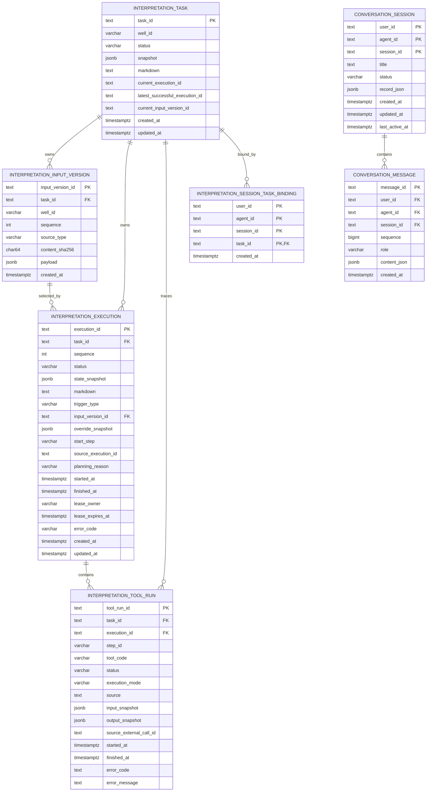
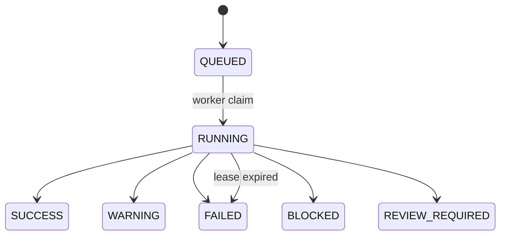

# 测井解释智能体数据库设计

本文记录 migration `0001`～`0007` 已实现的数据库事实。设计原则是 **Versioned、Append-oriented、Traceable、Recoverable**：输入、执行和工具调用以新版本追加，Task 只维护当前指针和兼容视图，运行失败也必须留下可查询事实。状态、枚举和规划原因的中文含义统一见 [11-status-enum-glossary.md](11-status-enum-glossary.md)。

## 1. 实体关系

图只画真实外键。`interpretation_execution.source_execution_id` 是来源引用，但 migration `0005` 没有为其创建数据库外键；Task 的三个当前指针同样由应用层保持一致。`(task_id, sequence)` 在 InputVersion 和 Execution 上分别唯一。

## 2. Task 与版本化输入

`interpretation_task` 表示一口井的持续任务。`status`、`snapshot`、`markdown` 是从 `0001` 保留的兼容当前视图；版本事实已分别进入 Execution 和 InputVersion。新代码通过 `current_execution_id`、`latest_successful_execution_id` 和 `current_input_version_id` 定位版本，不覆盖历史行。

`current_execution_id` 指向当前选中的最新 Execution，因此可对应 `QUEUED`（排队等待）、`RUNNING`（正在执行）、失败类终态或成功类终态。`latest_successful_execution_id` 只在 Execution 进入 `SUCCESS` 或 `WARNING` 且形成可用报告时更新，用于寻找最近可靠的复用和历史报告基线。

InputVersion 的 `source_type` 当前只允许 `UPLOAD`（用户上传）或 `FIXTURE`（演示/测试夹具）。上传内容先经过确定性解析和 `MockFixture` Schema 校验，再按字段排序序列化并计算 `content_sha256`；`payload` 保存规范化 JSON，不保存原附件名、二进制或临时路径。Worker 执行时从所选 InputVersion 重新物化临时文件，因此重启后不依赖旧临时目录。

## 3. Execution 与生命周期

每次首次执行、局部重跑或全量重跑都新增一条 Execution。字段含义如下：

- `sequence`：Task 内连续版本号；`trigger_type` 为 `INITIAL`（首次触发）或 `RERUN`（重跑触发）。
- `input_version_id`、`override_snapshot`：本次执行实际使用的输入和四个有效参数快照。
- `start_step`、`source_execution_id`、`planning_reason`：执行起点、可复用成功来源和确定性规划原因。
- `state_snapshot`：本次 W01～W10 的完整 `InterpretationState` 快照。
- `markdown`：本次 Execution 的最终或诊断报告。
- `started_at`、`finished_at`、`lease_owner`、`lease_expires_at`、`error_code`：后台生命周期和失败诊断。

`ExecutionStatus`、W01～W10 的 `StepStatus`、`ToolRunStatus` 是三个不同状态域，不能互换。Execution 没有 `PENDING`（等待执行）；`PENDING` 是 Workflow 步骤状态。ToolRun 当前状态为 `RUNNING`（工具正在执行）/ `SUCCESS`（工具执行成功）/ `WARNING`（工具完成但有告警）/ `FAILED`（工具执行失败）。

Execution 终态中的 `SUCCESS` 表示执行成功，`WARNING` 表示完成但有告警，`FAILED` 表示执行失败，`BLOCKED` 表示被关键资料或前置条件阻断，`REVIEW_REQUIRED` 表示需要人工复核。

## 4. 局部重跑和参数快照

当前合法 `start_step` 只有 `W01`、`W02`、`W04` 和 `None`：

| 变化 | 复用 | 新执行起点 |
| --- | --- | --- |
| 全量重跑、输入内容变化、无可靠成功来源 | 无 | W01 |
| `sampling_interval` 变化 | W01 | W02 |
| `por`、`perm` 或 `prediction_model` 变化 | W01～W03 | W04 |
| 参数被改回成功来源值且无需重算 | W01～W10 结果 | `None`，只重新生成报告 |

`override_snapshot` 固化 `sampling_interval`、`por`、`perm`、`prediction_model` 的本次有效值。POR/PERM 不会写回原井资料。当前没有 SW-only 重跑，也没有让用户或模型直接指定 `start_step`。

## 5. 状态快照策略

稳定、需要约束和关联查询的审计事实采用关系列：版本号、状态、来源、起止时间、租约、错误码及外键。仍在演进且需要整体恢复的业务状态采用 JSONB：`state_snapshot`、规范化输入 `payload`、参数快照和 Tool 输入输出。该组合既保留数据库约束和审计能力，也避免在最终井数据 Schema 冻结前把每个专业字段提前拆表。

## 6. ToolRun

`interpretation_tool_run` 是已实现的持久轨迹，不是待办。每次专业 Tool 调用记录：

- 身份：`tool_run_id`、`task_id`、`execution_id`、`step_id`、`tool_code`；
- 状态和模式：`status`，以及 `MOCK`（模拟执行）/ `REAL`（真实执行）/ `VIRTUAL`（虚拟/逻辑执行）/ `DERIVED`（由共享调用结果派生）；
- 来源：`source` 表示本次结果来源，业务输出中的 `prediction_source` 表示专业预测来源，两者语义不同；
- 快照：`input_snapshot`、`output_snapshot`；
- 外部关联预留：`source_external_call_id`；
- 运行信息：`started_at`、`finished_at`、`error_code`、`error_message`。

ToolRun 状态为 `RUNNING`（工具正在执行）、`SUCCESS`（工具执行成功）、`WARNING`（工具完成但有告警）、`FAILED`（工具执行失败）。company_mock 的批量入口是 `MOCK`（模拟执行），从共享批量结果拆出的细分 ToolRun 是 `DERIVED`（派生结果），不能把后者当成独立公司 API 调用。

当前没有 `ExternalPredictionCall` 或 `PredictionArtifact` 表。未来接入 Heavy Prediction API 时，可在确认重试、幂等、成本和产物契约后新增；现阶段仅保留 `source_external_call_id`，不能宣称已接入。

## 7. SessionTaskBinding

Migration `0006` 创建 `interpretation_session_task_binding`。复合主键是 `(user_id, agent_id, session_id, task_id)`，`task_id` 外键在 Task 删除时级联清理。它是任务归属的 PostgreSQL canonical fact。

会话 runner 的 `observed_task_ids` 只是进程内加速缓存。缓存未命中时按完整会话身份查绑定；Backend 重启后，`SessionTaskToolFactory` 从绑定表恢复 runner 和任务 ID，再由 Read API 查询 Task、Execution、ToolRun 和报告。Redis 中的聊天会话不能代替业务 ownership。

## 8. 报告存储

当前报告与产生它的版本一一对应，存入 `interpretation_execution.markdown`；Task 的 `markdown` 只保留兼容当前视图。读取历史报告时按 Execution ID 或受控 selector 选择，不从聊天文本重建。

当前不建独立 Report 表，因为还没有报告编辑、审批、签名、发布状态、多格式制品或 PDF 生命周期。出现这些独立生命周期后再引入 Report / Artifact 实体，避免提前复制 Execution 的版本边界。

## 8.1 ConversationSession 与 ConversationMessage

Migration `0007` 创建 `conversation_session` 和 `conversation_message`。Session 使用
`(user_id, agent_id, session_id)` 复合主键；Message 使用全局唯一 message_id，并以 Session 内
sequence 唯一约束保持稳定顺序。Message 的 content_json 保存可还原 AgentScope Block 的结构化展示副本。

Conversation 与 SessionTaskBinding 职责独立：前者保存聊天生命周期，后者保存测井 Task ownership。
ConversationMessage 的唯一级联目标是其 ConversationSession；删除聊天不会删除 Binding、Task、
Execution、ToolRun 或报告。详细恢复、TTL、幂等和去重边界见
[12-conversation-persistence.md](12-conversation-persistence.md)。

## 9. 并发、租约与恢复

创建新 Execution 时，Repository 对 Task 执行 `SELECT ... FOR UPDATE`，并校验规划携带的 `expected_current_execution_id`。指针已变化说明计划过期；当前 Execution 仍为活跃状态则返回 `TASK_EXECUTION_ACTIVE`。这保证同一 Task 只有一个当前活跃执行。

Worker 以原子 `claim_execution` 把 `QUEUED` 改为 `RUNNING`，写入 owner 和过期时间；运行期间按租约周期约三分之一心跳续租。终态写入必须匹配 worker、未过期租约和 Task 当前指针，并同时清空租约。启动和周期恢复使用 `FOR UPDATE SKIP LOCKED` 扫描过期 RUNNING，将其标记为 `FAILED`，不会自动重放可能有副作用的 Workflow。

## 10. PostgreSQL 与 Redis

| 存储 | 当前职责 | 丢失后的含义 |
| --- | --- | --- |
| PostgreSQL | Task、InputVersion、Execution、ToolRun、SessionTaskBinding、报告、Conversation、租约和审计事实 | 长期事实丢失，不允许伪装成功或自动降级到内存 |
| Redis | 可丢弃的 `InterpretationState` 运行检查点；有 TTL 的 AgentScope 活跃 Session / Message cache；无 Session TTL 的服务凭证等资源 | Conversation 和业务读取可分别由 PostgreSQL 恢复；实时流事件可能丢失 |

PostgreSQL 是 canonical source。Redis 写入使用带 TTL 的 SET，Key 中的 Task ID 被 SHA-256 散列；Redis 可过期或清空，PostgreSQL 的版本、归属和报告不应因此消失。

## 11. Migration 历史

| Revision | 变化 |
| --- | --- |
| `0001` | 单 Task 快照、状态和 Markdown |
| `0002` | Versioned Execution、当前和最近成功指针，并迁移旧快照 |
| `0003` | InputVersion、输入指针、Execution 输入引用和 Override 快照 |
| `0004` | 持久化 ToolRun |
| `0005` | Execution 起点、来源、规划原因、时间、租约和错误码；旧活跃状态迁移为失败 |
| `0006` | durable Session ↔ Task binding |
| `0007` | durable Conversation Session / Message、ownership、消息顺序与幂等键 |

Migration 必须显式执行，应用启动不自动改表。正式井数据字段仍为 **Pending final well-data schema**。
