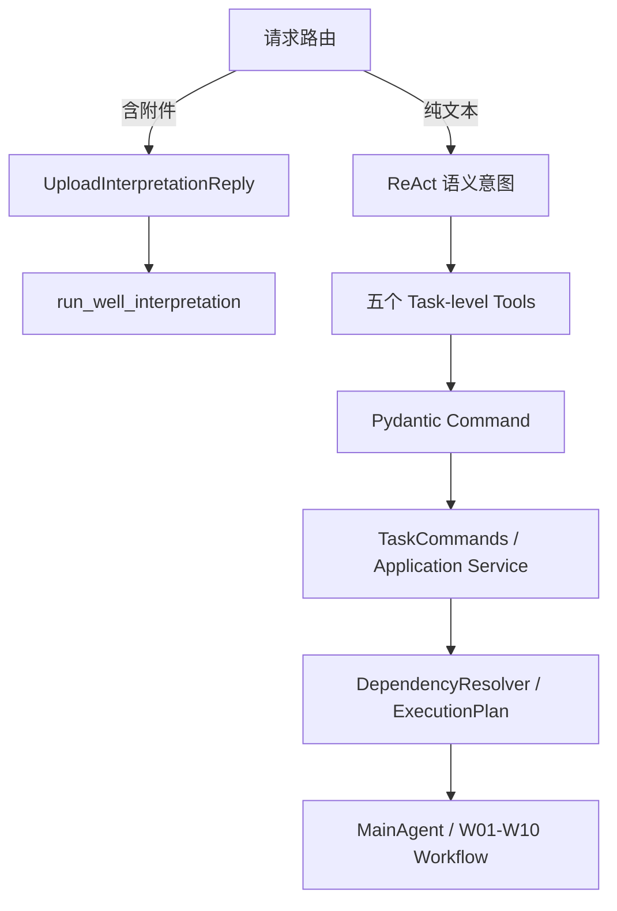

# 测井解释智能体意图识别与交互设计

本文描述当前已实现的自然语言入口。系统没有独立 `IntentClassifier`。状态、枚举、任务引用和报告 selector 的中文含义统一见 [11-status-enum-glossary.md](11-status-enum-glossary.md)。真实模式由 AgentScope ReAct Agent 使用 `qwen-plus`，结合固定系统提示、五个业务任务级 Tool 与一个纯交互 Tool 的描述和 JSON Schema 选择动作；业务参数随后由 Pydantic Command 校验，局部重跑由确定性的 `DependencyResolver` 决定。

## 1. 四层边界

四层分别是：

1. **Request Route**：根据当前轮是否有附件做确定性分流。
2. **Semantic Intent**：纯文本由 ReAct 理解用户想启动、修改、重跑、查状态还是读报告。
3. **Action**：五个业务任务级 Tool 与一个纯交互澄清 Tool；InteractionPolicy 集中裁决状态可用性。
4. **Validation and Planning**：Pydantic、Command 和 DependencyResolver 校验参数、归属、并发和依赖；LLM 不能指定 Workflow 起点。

## 2. 附件路由

附件请求不发送二进制给 qwen-plus。`UploadInterpretationReply` 调用 `parse_upload`，限制一份 JSON、大小和编码，校验并规范化为 `MockFixture`，再直接调用 `run_well_interpretation`。上传失败返回确定性错误；成功后创建 InputVersion 和 `QUEUED` Execution，并进入首次解释流式回复。

这条路由保证附件内容不会膨胀模型上下文，也避免模型从二进制中猜测井号。附件仍由 AgentScope 消息存储保存，但专业执行只读取已校验的 InputVersion。

## 3. 纯文本 ReAct 路由

没有附件时，`LoggingInterpretationDemoAgent` 是 AgentScope ReAct Agent。真实模式固定使用 `qwen-plus`，允许模型读取对话语义并按 Tool 描述与 JSON Schema 形成调用。Task 10.3 在每次推理前注入仓库派生的 InteractionSnapshot；模型可见 Schema 只使用 task_reference，旧 Python task_id 调用保持 adapter 兼容。Tool 结果中的 `task_id` / `execution_id` 才是可信标识；模型输出本身不构成任务归属或执行事实。

| Intent | Task-level Tool | Required Context | 参数 | 只读 | 创建新 Execution |
| --- | --- | --- | --- | --- | --- |
| START（开始解释） | `run_well_interpretation` | 已校验上传或 fixture | `well_id` | 否 | 是，同时创建 Task / InputVersion |
| MODIFY（修改参数并重跑） | `modify_well_interpretation` | 当前会话拥有的 Task | `task_id`、变化字段 | 否 | 是 |
| FULL_RERUN（全量重跑） | `rerun_well_interpretation` | 当前会话拥有的 Task | `task_id` | 否 | 是，从 W01 开始 |
| STATUS（查询状态） | `get_interpretation_status` | 当前会话拥有的 Task | `task_id` | 是 | 否 |
| GET_REPORT（查询报告） | `get_interpretation_report` | 当前会话拥有的 Task | `task_id`、selector 或可信 execution_id | 是 | 否 |

报告 selector 支持 `CURRENT`（当前版本报告）、`PREVIOUS`（当前井上一版报告，不跨 Task）、`LATEST_SUCCESSFUL`（当前井最近成功报告）。显式 `execution_id` 仍需验证属于该 Task。

START、MODIFY 和 FULL_RERUN 的 Task Tool 返回 `QUEUED/RUNNING` 与可信
`task_id + execution_id` 后，统一进入 `ExecutionReplyStreamer`。ReAct 只负责选择动作；
W01～W10、专业 Tool、RUN/REUSE 和报告均来自该 Execution 的持久事实与 Telemetry，
不会再次经过 qwen-plus 生成。STATUS 与 GET_REPORT 是只读动作，调用 Tool 后按受控读模型直接生成回复。澄清／稳定拒绝也直接输出固定文案，不让模型重复重试或改写。

### 3.1 意图矩阵

| 用户表达 | Intent | Tool | 结果 |
| --- | --- | --- | --- |
| 帮我解释这口井 + 文件 | START | `run_well_interpretation` | Execution #1 |
| 把孔隙度改成 0.16 | MODIFY | `modify_well_interpretation` | 新 Execution |
| 把 POR/PERM 改成 0.16 | MODIFY | `modify_well_interpretation` | 新 Execution |
| 全部重新跑 | FULL_RERUN | `rerun_well_interpretation` | 全流程新 Execution |
| 现在处理到哪里了 | STATUS | `get_interpretation_status` | 读取真实状态 |
| 现在执行到哪里了 / 处理到什么地方了 / 现在到哪一步了 | STATUS | `get_interpretation_status` | 读取当前 Execution |
| 给我上一版报告 | GET_REPORT | `get_interpretation_report(PREVIOUS)` | 历史报告 |
| 给我当前报告 | GET_REPORT | `get_interpretation_report(CURRENT)` | 当前报告 |
| 最近成功报告 | GET_REPORT | `get_interpretation_report(LATEST_SUCCESSFUL)` | 最近成功版本 |
| 帮我看看天气 | OUT_OF_DOMAIN（领域外请求） | none | 不调用测井 Tool |

## 4. 参数理解和校验

当前 `InterpretationOverride` 只支持：

- `sampling_interval`：正浮点数；
- `por`：0～1；
- `perm`：非负数，正式单位和专业规则待确认；
- `prediction_model`：受限标识字符串。

自然语言中的百分数必须先转成比例，例如“孔隙度 16%”进入 Command 时是 `por=0.16`。孤立的“0.16”若无法确定指 POR、PERM 还是采样间隔，模型必须调用纯交互工具保存完整 PendingClarification，不能猜测；紧邻下一轮参数名可通过 modify 的 parameter_name 补齐。空修改、类型错误、越界值和没有实际变化都会由确定性校验拒绝。

当前不支持并不得补造以下业务规则：

- `Rw`、Archie `m/n` 等尚未进入 Override 契约的参数；
- 用户直接设置或估算 `Sw`；
- 只执行 W06 或 SW-only 的细粒度重跑；
- 用户或 LLM 直接指定 `start_step`；
- 未确认的阈值、单位或公式。

## 5. 标识、归属和越界请求

同一 Session 是 `1:N InterpretationTask`。`active_task_id` 保存在 AgentScope
Session State 的 `middle_context` 中，只表示对话焦点，不进入
InterpretationTask 或数据库列。`SessionTaskResolver` 从 SessionTaskBinding
的稳定排序构建 Task Summary，支持：

- `CURRENT`（当前井/当前任务）：active task；状态丢失时 fallback 到当前 Session 最近绑定的 Task；
- `PREVIOUS_TASK`（上一口井/上一个任务）：active task 之前绑定的 Task；
- `WELL_ID`（按井号指定）：当前 Session 内同井号最近创建的 Task；
- `TASK_ID`（按可信任务号指定）：只有四元组 Binding 验证通过才可用。

“上一版”是 active task 的上一个 Execution，不跨井；“上一口井”是
`PREVIOUS_TASK`，报告默认取 `LATEST_SUCCESSFUL`。明确访问某井成功后，
该 Task 成为 active task，后续未指定井的修改作用于它。

首次 ToolResult 返回的 `task_id` 和 `execution_id` 会进入会话上下文，
但不再用“最近 ToolResult”代替任务解析。服务端以
`(user_id, agent_id, session_id)` 查询 SessionTaskBinding。内存集合
`observed_task_ids` 只加速命中，不能授权。错误 user、agent、session 或
Task 统一按不存在处理。

天气、股票、写故事、通用代码等与单井常规测井解释和任务操作无关的请求不调用业务 Tool，由 Agent 返回受限领域说明。ReAct 不能直接调用 `identify_lithology`、`calculate_sw` 等专业底层 Tool，也不能修改 W01～W10 顺序。

## 6. MockTaskShellModel 与真实模型

`MockTaskShellModel._command()` 是没有公网模型凭证时使用的本地确定性联调桩。状态查询使用小型确定性模式匹配，覆盖“执行到哪里”“处理到什么地方”“现在到哪一步”“当前进度/状态”等自然表达。它不代表生产意图识别架构，也不是独立 IntentClassifier。

真实路径是 `qwen-plus` ReAct：系统提示约束领域和 Tool 边界，Tool description 告诉模型动作语义，JSON Schema 约束参数形状，Pydantic 和应用层再次校验。专业 Workflow 内的模型访问仍走统一 ModelGateway，和外层任务意图模型承担不同职责。

## 7. Future 边界

以下概念用于未来更细的能力规划，当前没有实现：

- 统一 `OperationRequest`；
- `CapabilityRegistry`；
- 细粒度 `DependencyGraph`；
- 可持久化或可解释的独立 `ExecutionPlan` 实体；当前只有应用层确定性计划对象；
- SW-only 等步骤级重算。

未来若增加 `RECALCULATE_SW`、`REIDENTIFY_LITHOLOGY`、`REGENERATE_REPORT`、`CHANGE_PREDICTION_MODEL` 或 `REINTERPRET_INTERVAL`，应先形成结构化 `OperationRequest(intent, target, parameters, scope, task_id)`，再进入 CapabilityRegistry、DependencyGraph 和 ExecutionPlan，避免无限扩展 System Prompt。

扩展这些能力时仍应保持“ReAct 理解意图、Schema 校验参数、Resolver 决定依赖、Workflow 控制执行”的边界。

## 8. Task 10.3 交互状态控制

正式状态矩阵、策略、纯交互工具 Contract 和 pending 生命周期见
[10-interaction-state-machine.md](10-interaction-state-machine.md)。
InteractionSnapshot 是 Binding/Task/Execution/Session State 的派生读模型；没有新表或 migration。
运行中写操作在交互层返回包含 Execution 版本与步骤的 TASK_EXECUTION_ACTIVE，底层原子保护仍保留。
澄清只保留紧邻下一轮、最长 10 分钟；无关操作、断流、格式不完整或新 runner 后安全清除。
Context compression 保留完整 Session State，不从摘要恢复数值。

TaskReference 解析不改变焦点，成功操作才切 active；上一版与上一口井仍严格分离。
模型一次提出多个写操作时，在执行前拒绝整批，不部分完成后声称全部满足。
FAILED/BLOCKED/REVIEW_REQUIRED/WARNING 查询输出持久的安全诊断字段。
专业概念、局部重算和细层段证据查询属于测井领域的未开放能力，不降级为 OUT_OF_DOMAIN。
同井重新上传仍沿用创建新 Task 的行为；不实现同 Task InputVersion 替换。
