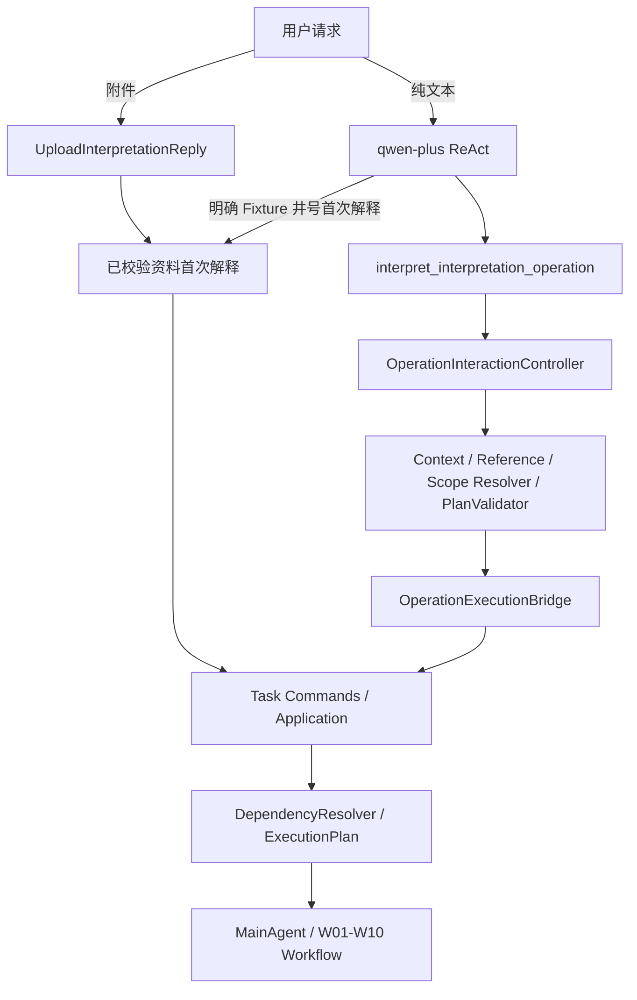

# 测井解释智能体意图识别与交互设计（Current Design）

Task 10.5-E2 已将 Operation 语义层接入 AgentScope ReAct / qwen-plus。系统没有独立
自然语言关键词分类器；MockTaskShellModel 仅是离线测试桩。稳定代码中文含义见
[11-status-enum-glossary.md](11-status-enum-glossary.md)。

## 1. 正式入口与职责

```mermaid
flowchart TD
    R[用户请求] -->|附件| U[UploadInterpretationReply]
    R -->|纯文本| A[qwen-plus ReAct]
    U --> S[已校验资料首次解释]
    A -->|明确 Fixture 井号首次解释| S
    A --> O[interpret_interpretation_operation]
    O --> C[OperationInteractionController]
    C --> B[Context / Reference / Scope Resolver / PlanValidator]
    B --> E[OperationExecutionBridge]
    E --> T[Task Commands / Application]
    S --> T
    T --> D[DependencyResolver / ExecutionPlan]
    D --> W[MainAgent / W01-W10 Workflow]
```

正式模型只看到 `run_well_interpretation` 与 `interpret_interpretation_operation`。
旧五个后续操作 Tool 和 `build_task_tools()` 保留供兼容调用与低层回归；生产
SessionTaskToolFactory 使用 `build_agent_task_tools()`，Agent 严格验证工具名称、实现与共享 Runner。
专业 Tool、文件系统、MCP、Skills 和任意 AgentScope 内置工具不进入这个 Toolkit。

附件仍由 UploadInterpretationReply 校验并调用 start_uploaded，不先让模型创建空任务。
无附件且无明确 Fixture 井号时提示上传资料。首次解释创建 Task / InputVersion / Execution。

## 2. 统一 Operation Tool Contract

| 项目 | 定义 |
| --- | --- |
| Name | interpret_interpretation_operation |
| Responsibility | 接收有限结构化语义，调用交互 Controller 与唯一执行桥。 |
| Input | 严格判别联合 OperationRequest；顶层只有 request，未知字段拒绝。 |
| Output | outcome、error_code、message、task_results、created_execution_ids、capability_facts。 |
| Error | 既有解析、规划、澄清及命令错误码；不回传原始异常或内部配置。 |
| Timeout | 复用 Repository/Redis 的基础设施超时与应用后台执行策略；不新增外部调用。 |
| Status | 命令成功不等于后台完成，执行终态读取 TaskCommandResult。 |
| Mock | MockTaskShellModel 产生同一 Schema 的调用，专业执行仍经过正式 Runner。 |
| Test | Tool 单测、脚本模型 ReAct、真实 qwen-plus、HTTP/SSE、PG/Redis 与页面验收。 |

| mode | 中文含义 | 输入和副作用 |
| --- | --- | --- |
| `PLAN` | 提交计划 | PartialOperationPlan；所有意图放入同一 operations，完整校验后才可能提交命令。 |
| `CLARIFICATION_REPLY` | 澄清补齐 | ClarificationPatch，仅修补允许槽位；完成后重新解析并执行一次。 |
| `CANCEL` | 取消待澄清计划 | 清除 Pending，零业务执行；不取消已运行的后台任务。 |
| `SET_ACTIVE_CONTEXT` | 显式切换操作焦点 | WRITE（写安全）规则解析 Task，可指定版本/范围；不创建 Execution。 |

AgentScope 2.0.8 会修复部分 JSON 并移除未知字段，因此 on_acting 先对原始 ToolCall 再做
Pydantic 校验。框架早于 on_acting 的 Schema 错误出口由项目 Agent 子类投影为安全固定错误，
终止本轮；不让模型绕过拒绝继续重试，也不显示框架原始异常。

## 3. 有限语义示例

| 用户输入 | 语义 | 当前结果 |
| --- | --- | --- |
| 孔隙度改成0.16 | MODIFY_PARAMETER（修改参数）、POROSITY（孔隙度） | 新版本，应用层决定复用范围。 |
| 孔隙度、渗透率都改成0.16 | 同一计划两个参数节点 | 聚合为一个命令、一个 Execution。 |
| 改成0.17 → 孔隙度 | 缺 TARGET（目标）→ 补齐 | 第一轮零执行，第二轮恰好一次。 |
| 全部重跑 | FULL_RERUN（全量重跑） | 保留有效参数，从 W01 开始。 |
| 当前报告 / 上一版报告 | REPORT（报告查询）、TASK_CURRENT（当前版本）/ PREVIOUS（上一版本） | 只更新 View，不改变当前版本或写焦点。 |
| 现在到哪一步 | STATUS（查询状态） | 读取当前 Execution 持久事实。 |
| 你能只重新算Sw吗 | CAPABILITY_QUERY（能力询问）、RECALCULATE（重新计算） | 返回真实能力目录，零执行。 |
| 第5层孔隙度改成0.16 | INTERVAL_ORDINAL（单层号引用） | 解析目标版本第5层后安全拒绝局部写；层号不存在则明确失败。 |
| 如果Sw大于60%就改成水层 | conditions（条件）+ MODIFY_RESULT（修改派生结果） | 条件执行未开放，整个计划零副作用。 |
| 算了 | CANCEL | 不让后续参数名恢复旧值。 |
| 不对，是第6层 | CORRECTION（修正） | 仅修正未执行 Pending，撤销相关旧锁并重新解析。 |
| 切到WELL_A继续处理 | SET_ACTIVE_CONTEXT | 显式改变 Active，清除旧 View（包括同井历史锚点）。 |
| 天气怎么样 | OUT_OF_DOMAIN（领域外请求） | 不调用业务 Tool。 |

数值位于 `operations[].parameters.value`，不能放在节点顶层。16% 的绝对孔隙度可表达为
ABSOLUTE（绝对设置）0.16 / unit=1；提高2% 使用 PERCENT_CHANGE（比例变化），当前安全拒绝，
不猜测成绝对值。非数值的分类要求保留在 original_instruction，不放入数值 ValueSpec。

## 4. Pending 生命周期

TaskCommandRunner 持有一个 OperationClarificationStore，owner token 与该会话 Runner 同寿命。
每轮 attach 新 middle_context 只更换引用，不重建 owner。Pending 使用独立 key
`cnlc_pending_operation_clarification`，沿用 begin/end_interaction_turn 的回合计数与配置 TTL。

首轮缺槽时保存完整 Partial Plan，只锁定 Resolver 成功授权的 Task / Execution / Scope。
普通补齐不得改变锁定对象；修正可撤销相关锁，但必须再次校验。执行前消费 Pending，成功、
失败均不重放。新计划、取消、无关下一轮、TTL 到期、owner 改变和 Redis miss 均清除旧 Pending。
普通浏览器刷新保留同进程 Runner + Redis 状态；PostgreSQL 不持久化 Pending，不从聊天恢复它。

## 5. 任务、版本与层段引用

SessionTaskBinding 是唯一授权来源。Active 是后续操作焦点，View 是刚查看的结果，Recent 是短期引用。
读取其他井或历史报告不能切换 Active；隐式写遇到 Active/View 冲突须澄清，不新建 Execution。
显式切井使用 WRITE 解析：同井多个 Task 且无唯一当前目标时拒绝猜测。切井成功后清除旧 View，
Recent 不变；未指定版本只设置 Active Task，不自动创建工作基线。

PREVIOUS 优先相对同 Task 的 View 版本，再按 Active Base / Task current 解析；例如 current=V4、
View=V3 时返回 V2。历史版本读取不改变 Task.current_execution_id；历史基线写仍未开放。

模型只可表达 INTERVAL_ORDINAL 或 MULTI_INTERVAL_ORDINAL（多个层号引用，正整数且稳定去重）。
ScopeResolver 从已授权 Task + Execution 快照解析成稳定 interval identity；完整 OperationPlan
不接收 ordinal。模型输入 Schema 隐藏且运行时拒绝 interval_id、interval_ids、resolved_ids。
局部范围不允许静默退化成整井，多个层号必须全部存在。

## 6. 流式展示和边界

创建型 Operation 结果兼容既有唯一 TaskCommandResult，继续由 ExecutionStreamingMiddleware 展示
W01-W10、专业 Tool、RUN（执行）/ REUSE（复用）、最终真实报告及版本历史。读取结果和澄清直接使用
安全服务端文案，助手正文不倾倒内部 Operation JSON。曲线图和右侧面板继续读取持久业务事实。

COMPARE（比较）、SCENARIO（试算）、任意局部重算、历史版本分支写、层段编辑、人工结果覆盖、
条件链执行与 Task11 依赖图仍未开放。W01-W10、三核心 Agent、DB Schema 与 migration 未改变。
详细验收见 [E2 执行记录](tasks/010-5e2-react-operation-integration.md)。

## 7. AgentScope 职责核验补充

Task 012E 对照 AgentScope 2.0.8 本地源码与真实模型实验后，确认 ReAct 的 Tool 选择不能替代 OperationPlan 这一稳定意图合同；Agent 给出的 task、execution、version、scope 仅是候选，必须经项目 Resolver、身份绑定、Validator/Policy 和写前重校验后才能到达应用命令。Skill 为可选方法知识，不是流程保证或权限组件；当前 qwen-plus 真实实验的 SkillViewer 调用为 0/60。

本设计描述的当前工具/解析行为没有因该审计自动改变。模块完整决策、四阶段与确认口径差异、Grounding Response Contract 和后续迁移次序见 [Task 012E](tasks/012e-agentscope-native-final-responsibility-boundaries.md)。

## 8. Response Evidence 与最终答复门控

Task 013 的 `ResponseEvidenceEnvelope`（最终回复证据合同）由服务端 `TaskCommandResult` 构造，标识 Task / Execution / 已解析 Scope / 输入版本 / revision / 操作 / 真实执行状态 / 来源 / evidence refs。其 immutable typed fields 供 `DeterministicRenderer`（确定性回复渲染器）读取；模型不得重写或覆盖这些事实。

| 状态 | 可渲染语义 | 禁止语义 |
| --- | --- | --- |
| `SUCCESS`（成功） | 仅在匹配 Task 与 Execution 证据存在时描述已完成；报告操作还须存在报告引用 | 不得仅凭 Operation Tool 的命令接受结果声明专业执行成功 |
| `QUEUED`（排队等待）/ `RUNNING`（正在执行） | 队列、运行、阶段或等待确认状态 | 不得说解释完成或修改已生效 |
| `NEED_CLARIFICATION`（需要澄清） | 只询问补充信息 | 不得假设范围或继续写入 |
| `UNSUPPORTED`（不支持）/ `REJECTED`（拒绝） | 说明能力边界或本次未执行 | 不得渲染成成功 |
| `FAILED`（失败） | 说明失败及下一步 | 不得隐藏错误状态 |

`REAL`（真实）、`MOCK`（模拟）、`FIXTURE`（夹具）、`DERIVED`（派生）、`MIXED`（混合）、`UNKNOWN`（未知）来自输入版本与现有 ToolRun 元数据。Fixture / Mock 回复正文明确标明“非真实业务结果”；UNKNOWN 标明来源未核验。AgentScope middleware 对没有 Application/Tool evidence 的最终文本进行确定性替换。以上为聊天回复控制，不代表独立 Read API 和任务面板已经全部切换至该合同。
