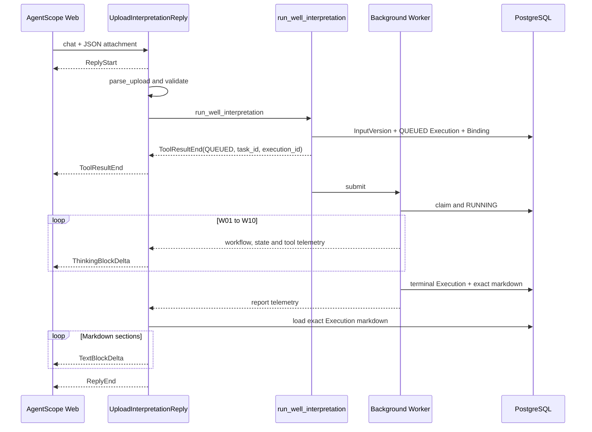
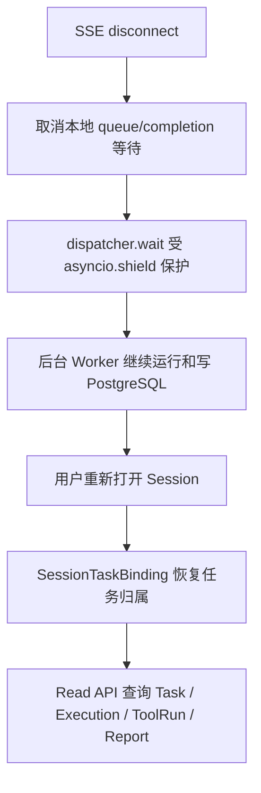

# 测井解释过程流式展示与前端职责设计

本文记录 Task 10.1 后的首次上传行为。旧实现只在 `run_well_interpretation` 返回 `QUEUED` 后显示“任务已提交”并发送 `ReplyEnd`；Worker 虽在后台继续，用户看不到 W01～W10 和报告过程。当前实现保持同一条 AgentScope SSE 回复，直到本轮 Execution 的最终报告已读取并发送。

## 1. 当前首次解释时序



`ToolResultEnd` 表示任务提交完成并提供面板打开所需的可信标识，**不表示 Workflow 已完成**。`ReplyEnd` 表示这次首次上传回复已经包含最终进度和报告，或者已经形成明确失败/阻塞/复核结果。

后台语义没有改变：Tool 很快提交 Execution，`InProcessExecutionDispatcher` 持有 Worker；HTTP/SSE 观察者等待完成不等于把业务 Workflow 改成同步执行。其他修改、全量重跑和查询命令仍按任务级 Tool 契约工作。

## 2. 事件来源和安全投影

`ExecutionProgressProjector` 只读取、去重并映射既有 Telemetry，不写状态、不决定下一步、不改变 Tool 结果。可见进度使用以下事件：

| Telemetry | UI 投影 |
| --- | --- |
| `workflow.step.start` | Wxx 步骤和所属业务阶段开始 |
| `state.change` | Wxx 成功、告警、失败、阻塞或复核，以及阶段完成 |
| `workflow.step.error` | 记录步骤异常；当前 projector 不直接生成自由文本 |
| `workflow.result` | 记录 Workflow 终态，控制报告开始事件是否可信 |
| `tool.start` | 专业 Tool 开始 |
| `tool.result` | Tool 成功或告警 |
| `tool.error` | Tool 失败 |
| `tool.end` | Trace span 结束；当前 projector 不重复展示 |
| `report.start` | 开始生成单井解释报告 |
| `report.end` | 报告生成完成 |
| `report.error` | 报告生成失败 |

投影器只接受固定 W01～W10、固定 Tool code 和静态步骤名，异常自由文本不直接展示，避免泄漏连接信息或把未受控内容当进度。

## 3. W01～W10 Business Stage 映射

| UI 业务阶段 | Workflow 步骤 |
| --- | --- |
| 数据解编 | W01 |
| 数据预处理与质量控制 | W02、W03 |
| 岩性识别 | W04 |
| 储层识别与物性评价 | W05 |
| 流体识别 | W06 |
| 油气水层分类 | W07 |
| 层段划分与有效厚度 | W08 |
| 综合验证 | W09 |
| 最终一致性检查 | W10 |
| 报告生成 | ReportAssembler / ReportGenerator |

这些名称是展示聚合，不是第二套 Workflow，也不是数据库中的 StageRun。

当前 UI 只展示代码中确有事件的六个专业 Tool：

| Tool code | 显示名称 |
| --- | --- |
| `get_well_data` | 获取井资料 |
| `check_curve_quality` | 曲线质量检查 |
| `identify_lithology` | 岩性识别 |
| `evaluate_petrophysics` | 储层物性评价 |
| `calculate_sw` | 含水饱和度计算 |
| `merge_intervals` | 层段划分/合并 |

不为没有真实调用的步骤编造 Tool 轨迹。

## 4. 用户可见过程示例

```text
开始解释井 WELL_MOCK_001

▶ 数据解编开始
  ▶ W01 加载井段资料
    → 调用工具：get_well_data（获取井资料）
    ✓ get_well_data 执行成功
  ✓ W01 加载井段资料完成
✓ 数据解编完成

▶ 数据预处理与质量控制开始
...

▶ 流体识别开始
  ▶ W06 识别流体性质
    → 调用工具：calculate_sw（含水饱和度计算）
    ✓ calculate_sw 执行成功
...

▶ 开始生成单井测井解释报告
✓ 单井测井解释报告生成完成

# 单井测井解释报告
...
```

## 5. Thinking 与最终报告

执行过程写入 `ThinkingBlock`，前端在本轮流式执行时默认展开，让用户看到阶段、步骤、Tool 和报告生成状态。最终 Markdown 写入独立 `TextBlock`，与过程文本分开。报告来自当前 `execution_id` 的 `interpretation_execution.markdown`，不会由外层 LLM 二次改写。

报告按 Markdown 一级到三级标题切成多个 `TextBlockDelta`。`CNLC_STREAM_REPORT_CHUNK_DELAY_SECONDS` 当前默认 `0.12` 秒，只让相邻章节进入不同渲染帧，不改变持久化报告。

## 6. SSE 断开与重新打开



断开连接只停止这个浏览器观察者。`dispatcher.wait()` 使用 `asyncio.shield`，取消等待不会取消 Worker；Worker 继续 claim、续租和落库。重新打开后，SessionTaskBinding、PostgreSQL 和只读 API 恢复右侧面板。当前不保存或 replay SSE 事件流，所以重连后展示持久状态和报告，不补播错过的 Thinking delta。

## 7. 页面职责

- **聊天区**：自然语言、首次上传的实时 Thinking、最终报告和任务级 Tool 调用。
- **Interpretation Panel**：当前/历史 Execution、W01～W10 状态、四阶段 RUN/REUSE 视图、有效参数、ToolRun 列表和报告。
- **History**：切换历史 Execution 后保持选中版本，后台刷新当前任务不会强制跳回当前。

未来可在右侧增加 GR、RT、DEN、CNL、AC、SP、CAL 等测井曲线、深度轨迹、解释层段、储层区间、岩性、流体、有效厚度和解释成果绘图。当前 Read API 没有冻结绘图数据契约，也没有选择绘图库。Curve Visualization 是 Future；应先定义曲线点、深度轴、单位、采样、缺失值、历史版本对齐和大数据传输边界，再实现 UI。Panel 应保留可扩展的可视化区域，技术选型待绘图数据契约确定后决定。

## 8. 展示节拍

`CNLC_STREAM_STEP_DELAY_SECONDS` 当前默认 `1.0` 秒。每个真实步骤进入终态后，SSE 展示协程暂停相应时间，便于观察；后台 Workflow、Execution、ToolRun 和数据库写入不被减速。因此快 Worker 可能已完成，而浏览器仍按队列展示此前事件，这是展示节拍，不是业务状态滞后。

建议后续 Task 将正常运行默认值评估为 `0`，演示环境显式设置非零值；需结合产品体验和测试重新确认。本次只记录现状，不修改配置，也不实施 Task 10.1.1。
