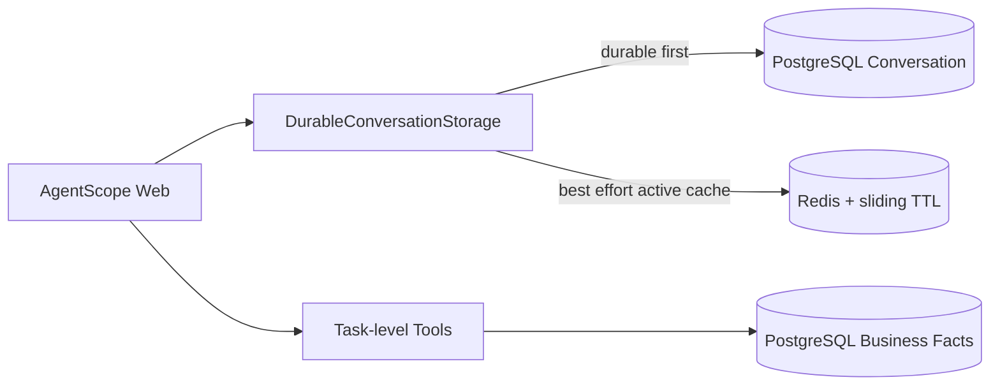

# Conversation 长期持久化与 Redis 生命周期（Current Design）

本文定义 Task 10.4 后的聊天存储边界。测井业务状态、状态枚举和任务引用仍分别以
[07-database-design.md](07-database-design.md)、
[11-status-enum-glossary.md](11-status-enum-glossary.md) 为准。

## 1. 当前架构



项目保留 AgentScope 2.0.8 `RedisStorage` 的完整 StorageBase 行为，并由
`DurableConversationStorage` 只覆盖 Session / Message 生命周期。创建、状态更新和消息写入先进入
PostgreSQL；成功后再写 Redis 活跃缓存。Credential、Agent、MCP 等上游资源继续由原
`RedisStorage` 管理，且不继承 Conversation TTL。

AgentScope 2.0.8 已提供 `AsyncSQLAlchemyStorage`，可以把所有 AgentScope 资源写入 SQL。
当前没有直接采用它，因为该实现会接管 Credential、Agent、Schedule、Team、Knowledge 等整套表，
同时不提供本 Task 要求的 Redis 活跃会话缓存。为两张 Conversation 表引入整套上游 Schema 会扩大
迁移和故障范围。因此本阶段采用官方 RedisStorage 子类 + 项目 ConversationArchive；没有修改或
monkey patch AgentScope 源码。

## 2. Conversation 与业务事实

`conversation_session` 和 `conversation_message` 是聊天生命周期的长期事实。
`interpretation_task`、InputVersion、Execution、ToolRun、SessionTaskBinding 和
`interpretation_execution.markdown` 仍是测井业务 canonical source。

AgentScope `Msg` 必须保留 Text、Thinking、ToolCall、ToolResult 和 DataBlock 的结构才能恢复历史 UI，
因此 `content_json` 保存完整结构化消息。这些 Tool / Report 内容是 **conversation presentation copy**：
它们不能替代 Execution、ToolRun 或 Execution report。业务读取继续使用稳定 task_id / execution_id 和
既有 Read API，不从聊天文本重建专业事实。

## 3. PostgreSQL 表

Migration `0007` 新增：

- `conversation_session`：`(user_id, agent_id, session_id)` 复合主键，保存标题、状态、完整
  SessionRecord、创建/更新时间和 `last_active_at`；另有 `(user_id, session_id)` 唯一约束，适配
  AgentScope Message API 缺少 agent_id 的签名。
- `conversation_message`：全局唯一 `message_id`、完整 ownership、Session 内 `sequence`、role、
  `content_json` 和 created_at；复合外键只在 Conversation 删除时级联消息。

`conversation_session` 没有指向 InterpretationTask 的外键，不能替代
`interpretation_session_task_binding`。删除 Conversation 不会级联 Task、Execution、ToolRun、Report
或 Binding。

## 4. Redis 活跃缓存与 TTL

`CNLC_SESSION_CACHE_TTL_SECONDS` 独立控制聊天缓存，默认 604800 秒（7 天）。
`CNLC_REDIS_TTL_SECONDS` 仍只控制 `RedisInterpretationStateStore`，二者不能混用。

以下 key 使用滑动 TTL，并在 Session 读写或 Message 写入时刷新：

- `agentscope:user:{user_id}:session:{session_id}`；
- `agentscope:user:{user_id}:session:{session_id}:messages`；
- 用户 / Agent 的 Session index；
- 使用 Schedule / Channel 来源时对应的 Session index。

Credential、Agent、MCP、Skill、Schedule、Team、Knowledge 等 key 不设置 Session TTL。实现把父类
`key_ttl` 固定为 `None`，再只对上述 Conversation key 调用 EXPIRE，避免 qwen-plus 后端凭证随聊天
过期。

## 5. 恢复流程

```text
Redis Session hit
→ 返回活跃 Session 并刷新 TTL

Redis Session miss / flush
→ 按 (user_id, agent_id, session_id) 读取 conversation_session
→ 回填 Redis Session cache
→ 历史 UI 分页读取 conversation_message
→ TaskCommandRunner 从 SessionTaskBinding 恢复任务集合
→ Read API 从 Task / Execution / ToolRun / Report 恢复业务事实
```

PostgreSQL Conversation 不存在时视为新 Session。只有 Binding、没有聊天归档时，不伪造聊天记录；
业务任务仍可由受控 Read API 查询。聊天中引用的 Task 后续被删除时，聊天展示副本可以保留，实际业务
查询按 Binding / Task ownership 返回不可用。

升级前 Redis 中已有的 Session 在首次读取或更新时被收编进 PostgreSQL；旧消息按 Redis 原始顺序一次性
归档，避免分页导入打乱 sequence。

## 6. 写入、幂等与故障

系统不使用 PostgreSQL + Redis 分布式事务：

1. PostgreSQL durable write 成功；
2. Redis cache best effort 写入并设置 TTL。

PostgreSQL 失败时抛出稳定 InfrastructureError，Redis 不会先返回假成功。PostgreSQL 成功而 Redis 失败
时保留 durable 事实并记录安全 warning；后续读取从 PostgreSQL 回填缓存。`message_id` 是幂等键；重复
保存更新原 payload 且保留原 sequence。新消息在父 Session 行锁内分配 `max(sequence) + 1`，复合唯一
约束是最终保护。

## 7. 删除与保留

AgentScope 删除 Session 时，先删除 PostgreSQL Conversation 和其 Message，再清 Redis cache / bus；
`SessionTaskBinding` 与测井 Task 默认保留。Clear Redis 只清缓存，不影响任何 PostgreSQL 行。

`CNLC_CONVERSATION_RETENTION_DAYS` 是可选长期保留天数；未配置表示长期保留。配置后，应用存储生命周期
启动时按 `last_active_at` 清理过期 Conversation，数据库只级联其 Message。该配置与 Session cache TTL
完全独立；本阶段不提供复杂合规归档或定时清理平台。

## 8. PendingClarification、active task 与 Context

归档 SessionRecord 前会删除 `cnlc_pending_clarification`。Redis 命中时它仍可在 Task 10.3 定义的短 TTL
和紧邻轮次内使用；Redis 丢失或 Backend 重建后不会从旧 Message 自动恢复。

`cnlc_active_task_id` 可作为 Session presentation state 保存；丢失或无效时，TaskReference 的 canonical
fallback 仍是 SessionTaskBinding 中最近绑定 Task，没有新增第二套 PostgreSQL 当前任务指针。

完整聊天历史通过 Message 分页恢复给 UI。模型运行上下文仍使用 AgentScope `AgentState.context` 和既有
context compression；Conversation repository 不把 100/500/1000 条历史一次性塞回模型上下文。

## 9. 安全与 ownership

Session 读写始终校验 `(user_id, agent_id, session_id)`；Message API 从唯一的 `(user_id, session_id)`
父会话解析 agent_id。错误 ownership 不通过仅凭 session_id 的查询泄露内容。连接串和凭证只读取本地环境
配置，不写日志或 Conversation payload。

## 10. 已知限制

- 当前是硬删除 Conversation，没有回收站或归档恢复 UI。
- 保留策略在存储启动时执行，没有独立定时调度器。
- 为保证 AgentScope 历史 UI 可恢复，结构化 Msg 仍可能包含报告或 ToolResult 展示副本；业务事实不读取该副本。
- 不提供语义记忆、搜索、编辑、分支、Embedding、Vector DB 或跨 Session 用户记忆。
- 消息历史读取以 PostgreSQL 为准；Redis Message list 只优化当前活跃写入，不承担 canonical 分页。
