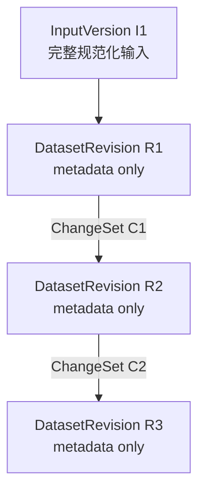
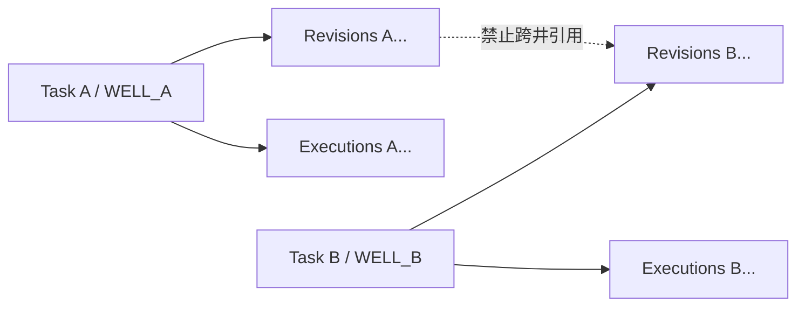

# Task 11B — Dataset Revision & ChangeSet

## 1. 目标与边界

本模型保存解编后曲线的局部修改。几十 MB 的完整曲线只存在于根
`InterpretationInputVersion`（解释输入版本）；后续 `DatasetRevision`（数据集版本）仅保存
lineage metadata，`DatasetChangeSet`（数据集修改集）仅保存实际变化的采样点。这样每次修改
几个点时无需复制整份 `RawData`。

| 概念 | 保存内容 | 本任务中的关系 |
| --- | --- | --- |
| `InterpretationInputVersion`（解释输入版本） | 已校验 `MockFixture` 完整快照 | Root Dataset 的来源，现有模型保持不变 |
| `DatasetRevision`（数据集版本） | 任务/井归属、父版本、ChangeSet 引用和 lineage 摘要 | 不可变，不含完整曲线 |
| `DatasetChangeSet`（数据集修改集） | 曲线、单位、采样索引、真实深度、前值和后值 | `CURVE_SAMPLE_PATCH`（曲线采样点修改） |
| `Execution`（解释执行版本） | 一次 W01～W10 执行事实及报告 | 本任务不绑定 DatasetRevision |

未来根数据可以迁移到 StageArtifact 或对象存储，而 DatasetRevision、ChangeSet 和 parent
lineage 契约无需改变。本任务不建设 StageArtifact、MinIO、S3、Parquet 或 LAS 对象管理。

## 2. 不可变 lineage

Root Revision 引用 `root_input_version_id`，其 `parent_revision_id` 和 `change_set_id` 均为空。
Child Revision 同时引用父版本和生成它的 ChangeSet，并继续引用相同 Root InputVersion。

Root 的 `lineage_sha256` 是 InputVersion 内容摘要的 SHA-256；Child 摘要由父 lineage 和
ChangeSet 内容摘要计算。它只表达版本链身份，不声称是完整物化数据内容摘要。

ChangeSet 摘要只规范化序列化服务端解析后的 `curve_code`、`unit`、`sample_index`、
`depth_m`、`before_value` 和 `after_value`；曲线与采样点按稳定键排序。它不读取用户原始
Patch Request，因此语义等价的最终解析事实得到相同摘要。

创建后没有 update 接口。再次修改会追加新 ChangeSet 和 Revision。调用方必须显式提供
`base_revision_id`，因此 `R1 → R2` 后仍可从 R1 创建分支 R3；服务不会猜测最新版本。

## 3. 稀疏 ChangeSet

外部 `DatasetPatchRequest`（数据集修改请求）只接受 MD（测量深度）、米、曲线代码、单位、
真实深度和目标值。`after_value` 可为 `null`，表示把采样点设为空值。调用方不提供
`sample_index` 或 `before_value`。

服务先物化可信 Base Revision，再精确匹配深度轴，由服务端解析索引并读取前值。当前不做
最近点匹配、插值、重采样、舍入猜测、TVD 或 TVDSS 转换。同一 ChangeSet 中相同曲线和
采样索引不能重复；没有实际变化时返回 `NO_EFFECTIVE_DATASET_CHANGE`（没有有效数据变化）。

持久 ChangeSet 的每个采样点只保存：

- `sample_index`（服务端解析的采样索引）；
- `depth_m`（基线中的真实 MD 深度）；
- `before_value`（可信基线前值）；
- `after_value`（目标值或空值）。

ChangeSet 不保存完整 depths、整条曲线或本地路径。

## 4. Materialize

`materialize(task_id, dataset_revision_id)` 从目标版本沿 parent 链查找 Root，检查循环和最大
深度，再读取 Root InputVersion 的 `payload.raw_data` 深拷贝，并按 Root → C1 → … → Cn
依次应用稀疏变化。应用时再次验证曲线、单位、索引、真实深度、前值、摘要和 lineage。

物化结果是临时深拷贝，不回写 InputVersion、历史 Revision 或 ChangeSet。R1、R2、R3
因此可在任意时刻恢复各自事实。

## 5. 原子持久化与多井隔离

PostgreSQL 表为 `interpretation_dataset_revision` 和
`interpretation_dataset_change_set`。创建 Child 时，ChangeSet 与 Revision 在同一事务内
写入；Revision 插入失败时不会留下 orphan ChangeSet。InMemory Repository 在同一锁内提供
相同语义。Task 删除级联清理其版本事实；Root InputVersion、父 Revision、ChangeSet 和可选
来源 Execution 使用受限外键，防止单独删除后破坏 lineage。

Root / Child 的 `sequence` 只在 Repository 的 Task 行锁或 InMemory 锁内分配。数据库同时
约束 `(task_id, sequence)` 唯一及非空 `change_set_id` 唯一，保证一个 ChangeSet 只产生一个
Child Revision；Root 的空 ChangeSet 引用不受唯一约束影响。

服务对 Task、well、InputVersion、Base Revision、ChangeSet 和可选 Execution 来源执行双重
归属校验，不读取 ActiveContext：

## 6. StageRun 与后续任务

一次成功 Patch 的业务影响固定为 `StageImpact.DATASET_PATCH`（数据集局部修改），但本任务
只创建 Dataset 版本事实。新 Revision ID 可在后续直接放入
`StageRun.output_refs["dataset_revision_id"]`，ChangeSet ID 可进入 `applied_change_ids`。

本任务不修改 StageRun、不回写历史 Execution、不让 W01～W10 暂停，也不伪造 StageRun 与
Revision 的绑定。创建新 Execution、把 PREPROCESS / INTERPRET / REPORT 置为失效、人工确认
及暂停恢复由后续 Stage Orchestrator 完成。LLM、ReAct、Operation Understanding、前端和
专业算法均保持现状。

No Architecture Issue found.
