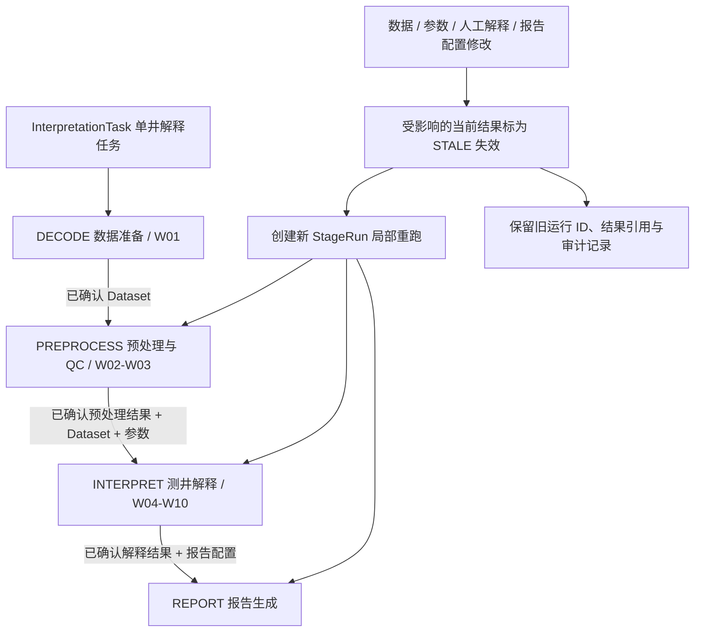
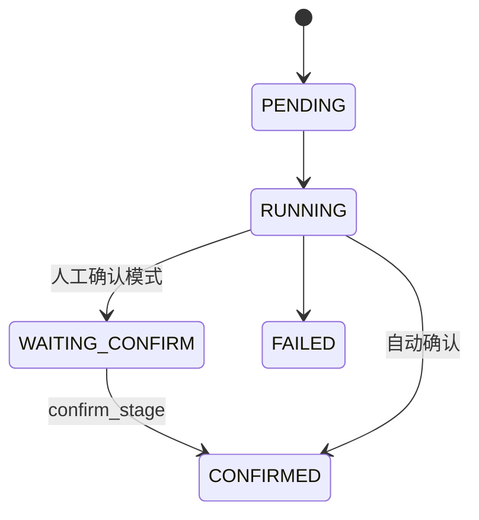

# Task 11A — Four-Stage Execution Model

## 1. 业务边界与现有执行链

`InterpretationStage`（解释业务阶段）复用既有 `ExecutionStage`（执行规划阶段），两者是
同一枚举对象。`DECODE`（数据解编 / 数据准备）是 `DATA_DECODE`（现有数据准备阶段）的
别名，序列化继续使用 `DATA_DECODE`，兼容已有 Demo、规划和持久化数据。

| 阶段 | 职责 | 现有执行位置 |
| --- | --- | --- |
| `DECODE`（数据准备） | 加载井与曲线资料 | W01（加载井段资料） |
| `PREPROCESS`（预处理与质量控制） | 完整性检查、曲线 QC 与已有预处理 | W02（完整性检查）～W03（曲线质量检查） |
| `INTERPRET`（测井解释） | 专业计算、解释、验证与最终检查 | W04（岩性识别）～W10（最终一致性检查） |
| `REPORT`（报告生成） | 消费正式解释结果生成报告 | 现有 InterpretationTaskService 调用 ReportAssembler |

Workflow 的节点顺序、Agent 职责、算法和报告正文保持现有实现。四阶段映射统一放在
`domain/stages.py`；应用规划通过兼容导入使用同一映射。MainAgent 继续调度现有 Workflow。

## 2. StageRun（阶段的一次真实执行）

| 字段 | 契约 |
| --- | --- |
| `id`、`task_id`、`execution_id` | 阶段运行 ID、任务归属、必填的现有 Execution 归属 |
| `stage`、`status`、`validity` | 统一阶段类型、执行生命周期和当前工作版本中的有效性 |
| `input_refs`、`output_refs` | 非空字符串键和值的逻辑引用，不保存曲线正文或绑定文件路径 |
| `applied_change_ids` | 为后续 ChangeSet 保留的逻辑 ID 列表；当前不实现 ChangeSet 存储 |
| `summary`、`warnings` | 阶段摘要与告警；告警不阻止成功结果自动确认 |
| `errors` | 复用 ErrorDetail（结构化错误），失败必须至少保留一项 |
| `started_at`、`finished_at` | 开始与结束时间，使用带时区的 UTC 时间 |
| `confirmed_at`、`confirmed_by` | 人工或系统确认时间与确认者，成对保存 |
| `stale_at`、`stale_reason`、`invalidated_by_change_id` | 失效时间、原因及可选修改 ID；只出现在新工作快照的失效视图 |
| `transitions` | 状态前后值、修改者、时间及原因，随快照持久化，不增加 Trace 事件 |

每个 StageRun 必须属于一个 Execution，不存在脱离 Execution 独立演进或单独持久化的
StageRun 版本体系。`InterpretationState.stage_runs` 保存阶段运行历史，既有 PostgreSQL JSONB 与 Redis 状态
序列化自动保存此字段，不增加数据库表或迁移。旧快照缺少该字段时默认空列表。

本次适配的结果引用形如 `execution:<execution_id>:<stage>`，指向现有 Execution 快照中的
正式业务结果字段；参数引用 `execution:<execution_id>:parameters` 指向现有参数快照，
报告配置引用 `report-config:style:<style>` 指明实际使用的既有报告样式。这些是逻辑引用命名约定，
不是已经建成的独立 Revision 实体或可直接查询的 Revision API。

DECODE 输入可携带现有 `input_version_id`。后续 DatasetRevision（数据集版本）建设时可直接
传入正式版本 ID，无须改变 StageRun 字段。当前记录实际报告样式，但尚无独立配置版本存储；预处理参数也引用当前执行参数快照。

## 3. 执行状态、有效性和确认

| StageRunStatus（阶段执行状态） | 含义 |
| --- | --- |
| `PENDING`（等待执行） | 尚未开始实际执行 |
| `RUNNING`（执行中） | 阶段正在执行 |
| `WAITING_CONFIRM`（等待确认） | 已成功产出，尚不能用于下游 |
| `CONFIRMED`（已确认） | 用户或系统确认，允许作为正式输入 |
| `FAILED`（执行失败） | 未成功完成，保留结构化错误 |

| StageValidity（阶段有效性） | 含义 |
| --- | --- |
| `CURRENT`（当前有效） | 当前工作版本允许消费该结果 |
| `STALE`（已失效） | 当前工作版本禁止消费该结果；执行终态仍保持原来的 CONFIRMED / WAITING_CONFIRM |

输入变化不属于执行状态转换，而是在新工作快照中将 `validity` 从 `CURRENT` 改成
`STALE`，同时保存 `stale_at`、`stale_reason` 和可选 `invalidated_by_change_id`。

`StageRun.transition()` 在领域层集中校验执行转换，原子构造新快照，原对象不被改写。
`confirm_stage()` 仅接受等待确认结果并记录确认者和时间。失败或失效记录不能重新启动；
重跑创建新的 ID。输入修改和确认不能替换成功结果引用或诊断。

当前 mock / demo 执行链沿用自动模式：成功边界由 system（系统）确认。人工等待与确认
由领域接口支持；暂停调度、确认 HTTP API 和确认 UI 留给后续任务。

StepStatus（步骤状态）、ExecutionStatus（后台执行状态）、PlanAction（规划动作）继续
承担原职责。阶段状态表达结果可用性，因此独立于这些枚举。步骤阻断或要求人工复核时，
该阶段记为执行失败，并保留原步骤的阻断 / 复核状态和结构化诊断；不把不完整输出标为可用。
失败链仍生成原有诊断报告，但诊断报告不作为正式 REPORT 阶段的确认结果。

## 4. 依赖校验与局部重跑

`validate_dependencies()` 是独立于执行顺序的规则：

- 预处理消费已确认的 Dataset 引用。
- 解释消费已确认的 Dataset、预处理结果及参数引用。
- 报告消费已确认的解释结果及报告配置引用。

按任务归属和历史追加顺序读取最新 StageRun；最新结果未确认、失效或失败时，不回退到
更早成功结果。输入 refs 必须与所选正式结果匹配；参数、报告配置引用必须存在。
解释还校验预处理结果绑定的数据集版本与选中 Dataset 一致，防止把新数据集和旧预处理结果混用。
这些规则不要求先重新执行上游，允许使用已经确认的前置结果局部重跑。

`domain/stage_runtime.py` 在 Workflow 阶段边界开始和结束运行；报告阶段由现有应用服务
记录。开始快照保存执行中状态，结束快照保存结果。报告异常、执行取消和基础设施异常
尽量同步结束活动阶段；存储不可用时显式记录保存失败，继续既有 Execution 失败终结流程。

StateReuseAssembler（状态复用装配器）只复用既有计划允许的业务字段与有效步骤前缀，
另以深拷贝把来源阶段历史投影到新的 Execution 工作快照。需要重新执行的当前成功结果
在新快照中标为失效；其执行状态、ID 和原 Execution 归属保持不变，复用阶段不产生新的
StageRun。仓库中的来源 Execution 快照绝不回写，V1 始终保留当时完整历史事实，V2
只保存自己的当前有效性视图和新产生的 StageRun。
完整历史仍可以通过既有 Execution 列表查询；新快照继承的是所选来源的阶段历史，
不是任务内所有分支的全量事件流。

旧快照没有 StageRun 时，适配器从已有装配器校验过的 ReusedStep（复用步骤）构造
来源字段逻辑引用，不补造真实历史运行。若新阶段记录已经存在，则必须遵守已确认规则。

## 5. 修改影响矩阵与失效语义

| StageImpact（修改影响类型） | 数据准备 | 预处理 | 解释 | 报告 |
| --- | --- | --- | --- | --- |
| `DatasetPatch`（局部数据修改） | 保留 | 失效 | 失效 | 失效 |
| `PreprocessParameterChange`（预处理参数修改） | 保留 | 失效 | 失效 | 失效 |
| `InterpretationParameterChange`（解释参数修改） | 保留 | 保留 | 失效 | 失效 |
| `InterpretationOverride`（人工解释修改） | 保留 | 保留 | 失效 | 失效 |
| `ReportConfigChange`（报告配置修改） | 保留 | 保留 | 保留 | 失效 |

`invalidate_from()` 返回新的深拷贝列表，只改变目标任务每个受影响阶段在新工作快照中的
有效性。旧 ID、执行状态、Execution 归属、
输入与输出引用、摘要、告警、错误、开始 / 结束及确认时间全部保留；追加失效原因和修改者。
多次相同失效操作幂等，不删除数据，不回写历史 Execution、不重写其他任务，受影响阶段执行中则拒绝修改。
接口返回深拷贝的新历史列表，调用方须在适当事务边界保存。当前没有新增编辑 API。

数据 Patch 不重新解编原始文件。未来由 DatasetRevision / Patch 服务先保存修改得到
新 Dataset ID，随后调用失效接口并把新 ID 传给下游依赖校验的 `dataset_revision_id`
选择参数。该参数必须由未来服务验证其任务归属和版本存在性。本次仅建立结构化接口，
不实施数据 Patch，不生成虚假的 Dataset 实体。

现有输入文件内容变化仍沿用既有完整重跑计划；它与已解编 Dataset 的局部 Patch 属于
不同输入动作。现有采样参数触发预处理及下游重跑，孔隙度、渗透率和模型参数触发解释
及报告重跑。人工解释修改不会修改 RawData（原始数据）。

## 6. 验证和后续依赖

领域测试覆盖人工 / 自动确认、失败、非法转换、五类影响、历史保留、跨任务隔离、
等待确认 / 失效 / 失败依赖拒绝、输入引用匹配及 Patch 新引用扩展。
集成测试覆盖现有十步链、两种局部重跑、失败诊断、旧快照兼容、报告异常与快照读回。

后续依赖：正式 DatasetRevision / Patch 持久化、参数与报告配置版本存储、带并发控制的
确认 / 修改应用接口、阶段展示与人工确认调度。本任务不新增基础设施或专业业务规则。

## 7. Task 012E 职责边界补充

Task 012E 审计确认当前模型为四个 Domain 阶段，用户确认是门控而非第五阶段。Agent 可提出查询、确认或局部重跑的意图；是否存在可推进阶段、依赖是否满足、结果是否有效以及确认状态如何持久化，仍由 StageOrchestrator 和 Domain State Machine 决定。AgentScope AgentState Task/Goal 不作为 StageRun / Execution 的替代。

口径待确认：当前人工模式的 StageOrchestrator 可让 `REPORT`（报告生成）进入 `WAITING_CONFIRM`（等待确认）；用户的目标流程说明仅列到解释完成后的确认，再生成报告。Task 012E 将这点标为 `VERIFY`（待核实），在业务确认前不修改现有实现或本四阶段模型。详见 [Task 012E](../tasks/012e-agentscope-native-final-responsibility-boundaries.md)。

Task 11A 完成时记录为 No Architecture Issue found；后续 Task 012E 发现 REPORT 确认口径待业务核实，详见下文 Task 012E 补充。该历史结论保留其当时语境。

### 本次验证记录

- 四阶段领域、复用装配、Schema 及 Workflow 相关测试：85 项通过。
- 真实 PostgreSQL / Redis 持久化套件：8 项通过，包含阶段检查点缓存及跨进程快照读回。
- 改动涉及的 7 个源文件 Ruff / Mypy 检查通过；Schema 同步检查与 diff 空白检查通过。
  全库 Mypy 与未修改 HEAD 均有 243 项既有错误，分布在 16 个文件。
