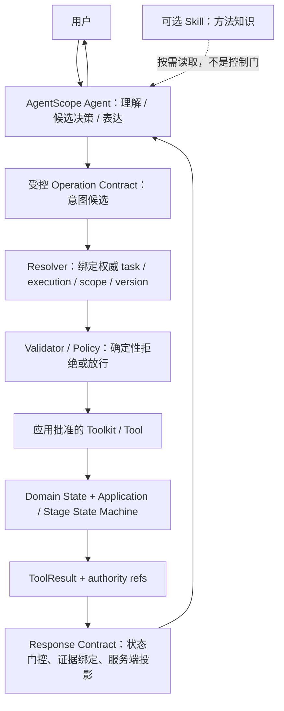

# Task 012E｜AgentScope 原生能力与项目架构阶段性职责边界（v0.1）

> 父任务：Task 012 / 012A / 012A.1
> 分支：`codex/task-12-agentscope-native-capability-poc`
> 证据基线提交：`a1afeae30e83ca81ed2307da5f7e1cb550f357eb`（Task 012A.1 结果基线；当前分支后续仍可能继续演进）
> 类型：架构审计与决策记录；不实施生产重构
> 日期：2026-10-04

## 1. 结论摘要

**AgentScope 负责对话运行时、模型调用、Tool schema/注册/分派及可选的 Skill/Tracing 接入；项目确定性代码继续负责授权身份、任务与版本解析、写入合法性、并发和阶段状态、持久化及业务结果事实。** 模型负责自然语言理解、候选意图/范围表达、有限能力选择与有证据的表达，不负责让候选意图变成已授权、可执行的写操作。

Task 012A.1 的真实模型证据没有证明 Skill 有净价值：qwen-plus 共 120 次运行（60 组 A/B 配对），with_skill 的 60 次运行没有一次调用 SkillViewer；路由、参数与澄清指标也没有改善。Grounding 和 overall 的 with_skill 组数字较高，但 Skill 正文没有进入模型上下文，不能将差异归因于 Skill。故 Skill 结论沿用 `NO_CLEAR_VALUE`（当前任务集无明确价值），生产定位为可选方法知识，不是控制或安全机制。

OperationPlan 不是 AgentScope ReAct 的重复 LLM 计划；它是模型提出的结构化意图/操作合同候选。Resolver、Validator、Policy 与 Bridge 也不是 Tool schema 的替代品：它们把候选请求绑定到受授权的 task/execution/scope/version，进行确定性校验并执行。当前链路确有边界分散与部分检查重复的可维护性问题，但证据不支持删除 Operation 层、Bridge 或 Validator。

本 Task 形成的是**阶段性职责边界**，用于约束后续实验和迁移次序，不代表 AgentScope 原生能力已经全部验证完成，也不修改生产代码。**没有模块获得 `REMOVE`（删除）决策。**

## 2. 范围、证据等级与基线

### 2.1 分支与实验事实

Task 012E 以 `a1afeae30e83ca81ed2307da5f7e1cb550f357eb` 作为 Task 012A.1 的证据基线；该提交属于当前实验分支历史。Task 012E 之后分支仍可能继续增加治理、证据和后续实验提交，因此不得再把该 SHA 描述为永久 HEAD。没有切换或修改 `main`。

Task 012A.1 结果文档记录的 qwen-plus 数据为：120 次真实模型运行，no_skill 60、with_skill 60；SkillViewer 调用 no_skill 0/60、with_skill 0/60；4 个 Skill-required 场景的 with_skill Viewer 调用为 0/20。Tool route 为 65.0% / 60.0%；参数正确率为 85.7% / 47.6%；澄清正确率为 90.0% / 20.0%；with_skill 有 3 次非法写入调用尝试（均被 POC Mock 拒绝，未触达生产数据）；Grounding 为 66.7% / 83.3%；overall 为 35.0% / 48.3%。结论为 `NO_CLEAR_VALUE`（当前任务集无明确价值）。详细口径、逐场景重复结果见 [Task 012A.1 实验结果](../evidence/05-Task012A1-Skill稳定性与Grounding实验结果.md) 和 `artifacts/native_poc/summary.json`。

Task 012A 的旧轮摘要为 no_skill 7/12、with_skill 9/12，Viewer 都为 0。被早期 Task 指定的 `docs/evidence/04-Task012A-Prompt-Toolkit-Skill实验结果.md` 在当前仓库不存在；因此本决策只引用 `summary.json` 保留的旧轮摘要和 Task 012A.1 对原始记录的说明，不声称读取了该缺失文件，也不重造旧证据。

### 2.2 代码与测试核验

决策依据包括实际生产实现，而不只是历史设计：`src/cnlc_agent/demo/` 下的 Agent、Operation contract/parser、InteractionContext、Resolver、Validator、Policy、Bridge、Runner、Tool 和回复 Middleware；`src/cnlc_agent/application/` 下的命令、StageOrchestrator、规划与端口；`src/cnlc_agent/domain/` 下的任务状态、Execution、StageRun、ToolRun；持久化、conversation 和 telemetry 适配器；相关 unit / integration tests。

安装在当前仓库 `.venv` 的 AgentScope 版本为 2.0.8。本决策关于原生 API 的表述限定于本地安装源码和当前实验观测，不外推到其他版本。

### 2.3 阶段模型口径

当前仓库可作为 Current Design 基线的阶段文档是 [四阶段执行模型](../architecture/four-stage-execution-model.md)，不是五阶段设计。四阶段是 `DECODE`（数据准备）、`PREPROCESS`（预处理）、`INTERPRET`（解释）、`REPORT`（报告）；用户确认是阶段间门控，不是额外的第五个业务阶段。用户给出的“解编→确认→预处理→确认→智能处理→确认→报告”与代码还存在一个需核实的口径差异：StageOrchestrator 的人工确认模式也可让 REPORT 进入等待确认并在确认后结束；当前描述中的确认点则止于解释之后。Task 012E 不改变此行为，待业务确认报告是否也应作为确认节点。

## 3. AgentScope 2.0.8 原生能力调查

本节以 `.venv/lib/python3.11/site-packages/agentscope/` 的实际实现为准。

| 能力 | 本地源码及运行事实 | 对项目边界的影响 |
| --- | --- | --- |
| Agent / ReAct | `agentscope/agent/_agent.py` 提供消息循环、模型调用、Tool call 处理和 Agent state；生产 `LoggingInterpretationDemoAgent` 使用 AgentScope `Agent` 与 qwen-plus。 | 适合候选意图理解与有限 Tool 选择；Tool call 仍只是模型提议，不是已授权业务动作。 |
| Toolkit / Tool | `agentscope/tool/_toolkit.py` 注册、列出 schema 并分派 Tool；支持 `tools`、`skills_or_loaders`、MCP 等注册入口。生产 Agent 明确拒绝带 MCP/Skills 的任意 Toolkit，并组装经批准的高层 task Tools。 | 原生 Toolkit 解决模型可见能力的注册与调用；不提供项目 task ownership、scope/version 解析或写前事务安全。 |
| Skill | `tool/_toolkit.py` 默认 Skill 指令把 `name` / `description` / `dir` 元信息放入有效 system prompt，并声明应通过内置 Viewer 按需读取正文；`skill/_local_loader.py` 解析本地 Markdown；`tool/_builtin/_skill.py` Viewer 名称为 `Skill`，schema 是必填精确名称 `{skill: ...}`。本地 loader 读到 `SKILL.md` 并不等于正文进入模型上下文。012A.1 with_skill 真实调用中 Viewer 0/60。 | 可选方法知识；只有观察到 `Skill` ToolCall 及正文 ToolResult 才能声称模型实际读取。不可承担流程控制或业务安全。 |
| AgentState / memory | `agentscope/state/` 有对话上下文、摘要、中间上下文和 `TaskContext` 数据对象。Agent 可将进行中 TaskContext 转成上下文文本。**当前项目本地 `.venv` 的 Task 012E 扫描没有定位到 `TaskCreate` / `TaskGet` / `TaskList` / `TaskUpdate`；但 AgentScope 官方 `v2.0.8` tag 的 `src/agentscope/tool/_task/` 明确导出并实现这些会话 Task Tools。** 因此这里存在“官方对应 tag 与当前本地安装/扫描结果不一致”的环境事实差异，不能据本地未找到就断言 AgentScope 2.0.8 官方不存在这些能力。无论是否存在，这些会话 Task Tools 都不等于带业务授权、版本和持久化语义的测井业务 Task 服务。 | 适合作为 Agent 会话态/提示上下文；不能替代 InterpretationState、Execution、数据库权限事实或跨会话业务状态。 |
| Tracing | `TracingMiddleware` 可为 Agent/model/Tool 活动提供 OpenTelemetry span。生产默认路径使用项目 `Telemetry` / LoggingTelemetry，并持久化 Execution、Stage/Step 和 ToolRun 业务事实；目前未见默认启用该 AgentScope tracing middleware。 | 原生 trace 可作为调用级观测适配器；不是业务审计记录、版本事实或可恢复事件源。 |
| HITL / interrupt / GoalPipeline | Task 012 的历史说明列有 Event、GoalPipeline 等能力，但本 Task 没有对它们做替代生产流程的对照验证；它们没有被当前业务 StageRun、并发和持久化契约覆盖。 | 不据历史能力列表推断可替换当前 Domain State Machine；相关替代结论为 `VERIFY`，不在本 Task 实施。 |

### AgentState Task API 版本事实核对

`docs/tasks/012-agentscope-native-capability-poc.md` 原文称 AgentState 内含任务上下文，并有官方 `TaskCreate / TaskGet / TaskList / TaskUpdate`。

当前证据必须分开记录：

1. **项目本地环境事实**：Task 012E 当时对当前 `.venv` 安装源码的扫描没有定位到上述 CRUD Tools；
2. **官方对应版本事实**：AgentScope 官方仓库 `v2.0.8` tag 的 `src/agentscope/tool/_task/__init__.py` 明确导出 `TaskCreate`、`TaskGet`、`TaskList`、`TaskUpdate`，并存在对应实现文件；
3. **业务架构结论不变**：这些 Task Tools 管理的是 Agent 会话内任务组织，不具有本项目 Task / Execution / InputVersion 的授权、版本、持久化和正式结果语义，不能直接替代业务 Task 服务。

因此后续如果要验证原生 Task planning，必须先在**当前实际安装环境**确认 import / Toolkit 注册行为，再做同场景 A/B；不得仅凭官方源码存在就宣称当前运行环境已经可用，也不得因本地扫描未找到就宣称官方 2.0.8 没有。

## 4. 当前架构与目标边界

### 4.1 当前生产链路

```text
用户自然语言
  ↓
AgentScope LoggingInterpretationDemoAgent + qwen-plus
  ↓ 候选高层 Tool call
Operation Tool / PartialOperationPlan
  ↓ 语法解析及交互模式识别
InteractionContext（view / active / recent 仅为提示）
  ↓
OperationExecutionBridge
  ├─ 确定性解析 task / execution / scope / version anchor
  ├─ PlanValidator + InteractionPolicy / capability check
  ├─ 适配为白名单 TaskCommand
  └─ 写前重新验证并交给 TaskCommandRunner / Application
        ↓
  TaskCommands / ExecutionPlan / Domain State / StageOrchestrator
        ↓
  PostgreSQL canonical facts + 项目 Telemetry / ToolRun
        ↓
  ToolResult / 权威状态 / 报告
        ↓
  服务端安全投影或 ExecutionStreamingMiddleware 最终回复
```

AgentScope 的 ReAct 决策是自然语言到候选 Tool 的规划，不应和 OperationPlan 混为同一个层次：前者选择“调用哪个可见能力”；后者是可解析、可审计、可拒绝的结构化请求；再后续 Resolver 与 Validator 才把请求绑定到权威业务对象并判定能否执行。

### 4.2 最小目标架构



模型可以表达候选 `action / target / ordinal scope / user-provided parameter`；不能自行决定授权身份、稳定数据库 ID、版本锚点、范围补全、权限、写入时机或当前指针。解析出的权威引用必须来自服务器状态，不能从模型 arguments 直接信任。

## 5. 模块职责审计与决策矩阵

判断词含义：`KEEP`（当前职责应保留）；`WRAP`（保留能力，但通过项目窄接口隔离原生 API 或缩窄宽泛门面）；`REPLACE`（目标设计中以更合适的边界替换当前形态，不代表本 Task 立刻改代码）；`REMOVE`（有证据支持删除）；`VERIFY`（证据不足，暂不作替换/删除决定）。

下表每行同时回答代码位置、实际职责/存在理由、AgentScope 是否提供同责能力、职责重叠、确定性责任、删除损失、测试/证据和结论。

| 模块 / 当前代码 | 实际职责与存在原因；AgentScope 对照 / 重叠 | 确定性责任、删除损失、测试与证据 | 决策 |
| --- | --- | --- | --- |
| Prompt — `src/cnlc_agent/demo/demo_agent.py:DEMO_SYSTEM_PROMPT` | 现在包含边界、参数说明、交互流程和大量何时调用 Tool 的程序化步骤；不是生产 Skill。AgentScope 提供 system prompt 拼接和 Skill metadata 注入，不提供项目业务政策裁定。它与 Operation contract / Validator 的行为说明有重叠。 | Prompt 本身不应是授权/校验事实源；删除整个 prompt 会失去必要原则与能力边界。Web Agent/Operation 集成测试保护调用边界，POC 也表明短 prompt 下 Tool route 仍有限。 | `REPLACE`：未来缩成原则、能力边界、输出约束；流程/条件分支交给代码和 Tool Contract。当前不改生产 Prompt。 |
| Agent — `src/cnlc_agent/demo/demo_agent.py:LoggingInterpretationDemoAgent`；`src/cnlc_agent/agents/{main_agent,interpretation_agent,validation_agent}.py` | Web 外层 Agent 做交互、意图理解及高层 Tool 选择；MainAgent 调度 Workflow，专业 Agent 按既定职责运行。AgentScope 提供循环、模型调用与 Tool call，不提供项目领域授权。与 Prompt 的自然语言策略有相邻边界。 | 业务执行不依赖 Agent 内存作为事实；删除 Web Agent 则失去自然语言入口，删除专业 Agent 会失去当前职责编排。`test_real_operation_react`、Demo Agent 集成测试及 Workflow 测试覆盖部分路径。012A.1 参数/澄清错误证明模型判断不具安全确定性。 | `WRAP`：保留 AgentScope Agent，通过批准的 project Tool factory、middleware 和结构化 Operation 隔离。 |
| Skill — POC `experiments/agentscope_native_poc/skills/`；生产 Agent 明确不接 Skill Toolkit | AgentScope 提供 metadata、Viewer 与按需取正文。Skill 只能提供方法说明，与 Prompt 可能重叠；模型是否读取由模型决策。 | 不承担任何确定性责任。若删除 Skill 会失去可选方法资料，不会失去授权或执行安全。离线注册/Viewer 有测试；真实模型 0/60 Viewer、Skill-required 0/20、`NO_CLEAR_VALUE`。 | `VERIFY`：不纳入生产控制链；只在未来先证明自然 Viewer 调用后再验证方法价值。 |
| Toolkit — 当前 demo Agent 以批准 Tools 构造 `agentscope.tool.Toolkit` | 原生 Registry、schema 暴露和 dispatch；生产还用构造路径限制模型可见的高层 Tools。AgentScope 已提供框架层同一注册/dispatch；和应用允许清单存在互补而非完全重复。 | Toolkit 清单与 Tool schema 是边界的一部分，但不做授权或原子写入。删除会失去模型能力注册与调用。受批准工具限制测试及 POC 相同 Toolkit A/B 测试保护。 | `WRAP`：保留 AgentScope Toolkit，项目提供 allowlisted factory；禁止任意内置 Tool/MCP/Skill 混入生产。 |
| Tool — `src/cnlc_agent/demo/operation_tool.py`、`task_tools.py`、`application/commands.py` 及专业 Tools | 将受支持的输入映射为单一业务能力并返回结构化结果；AgentScope `ToolBase` 是适配器，不等于业务 Contract。与 Runner 有调用链关系，不重复自然语言理解。 | schema、状态码、失败契约、Mock/Real 边界和执行结果必须确定。删除 Tool contract 会让执行入口变成任意 Agent 逻辑。Operation Tool、TaskCommand、专业工具测试及 ToolRun 持久化测试覆盖。POC 也显示 schema 本身不总能让模型路由正确。 | `KEEP`：工具执行职责清晰，继续单一职责且与框架类型隔离。 |
| Memory — AgentScope `AgentState` memory/context；生产对话见 `infrastructure/conversation.py` | 管理会话消息、摘要/中间上下文与对话恢复；项目 PostgreSQL 持久化优先、Redis 活跃会话缓存 best effort。不是结构化业务长期记忆。AgentScope 自带状态对象/可选 memory middleware，但不提供本项目会话持久化语义。与 InteractionContext 都是短时上下文，必须区分。 | conversation store 的恢复、清理和隐私边界是确定性应用责任。删除会失去对话连续性；持久化/恢复单元测试保护。 | `WRAP`：保留 AgentState 作为运行时会话适配；业务事实不写入非权威 memory。 |
| State — AgentScope `AgentState`，序列化/缓存由 conversation adapter | 当前单 Agent 会话运行态，包括 messages、summary、middle_context、task context；框架原生同责。和项目 InteractionContext 相交但后者只存业务引用提示。 | 不承担 task/execution 权威状态。删除会损失 Agent 对话延续；`tests/unit/test_conversation*` 和 Agent 集成测试保护。 | `KEEP`：用于 Agent runtime；不得让其替代 Domain State。 |
| Domain State — `src/cnlc_agent/domain/{state,execution,stages,tool_run}.py` | InterpretationState、版本化 Execution、StageRun、ToolRun 等可追溯业务事实。AgentScope 没有项目同语义实体；AgentState 与它不是重复。 | 任务/版本/阶段可用性、输入输出引用、确认、历史和执行事实均确定性保存。删除将破坏业务可恢复性、版本安全和正式结果。领域、集成、持久化测试覆盖。 | `KEEP`。 |
| InteractionContext — `src/cnlc_agent/demo/interaction_context.py` | Active/View/Recent 是会话短期提示，支持“这段/上一版”理解；没有授权效力，最终需 Resolver 回查。AgentScope 对话 context 能保存文本，但没有该业务引用语义。与 AgentState middleware 中的 transient fields 有存储层重叠。 | 区分当前工作焦点和只读浏览上下文是确定性安全辅助。删除会使 follow-up 失去显式锚点；interaction context/resolver 测试覆盖。 | `KEEP`：作为非权威 hint，任何读取/写入均重新解析。 |
| OperationPlan — `src/cnlc_agent/demo/operation_models.py`，解析见 `operation_parser.py` | Partial/complete Pydantic 合同表达用户的 action、target、参数、ordinal scope、约束与引用候选；构造本身不代表可执行。不是 Workflow，也不是模型内部规划的镜像。AgentScope ReAct 规划“调用哪个 Tool”；OperationPlan 为候选业务动作提供稳定、可审计、可拒绝的协议。 | 不可包含并信任模型给出的授权 task ID、resolved interval ID 或 current version 结论；权威 anchor/scope 由 Resolver 生成。删除会丢失统一多步输入解析、澄清缺槽与审计合同。`operation_models/parser/tool/validator` 测试、`test_real_qwen_operation_clarification_and_atomicity` 及 012A.1 参数/澄清错误为证。 | `KEEP`：保留为稳定 intent contract；裁剪未开放能力与非必要字段，不将它升级为执行计划。 |
| Resolver — `operation_context_resolver.py`、`reference_resolver.py`、`scope_resolver.py` | 前者从话语/context 生成候选 hint；后两者根据 session binding、Repository、授权 execution 快照确定 task/execution、PREVIOUS/CURRENT 锚点、ordinal scope 到稳定 interval identity。AgentScope 只做语言理解，不提供权威领域解析；模型候选与最终解析分层，因此非重复。 | 最终 task_id / execution_id、scope、CURRENT/PREVIOUS、Active/View 锚点、权限归属必须确定性解析；删掉权威 Resolver 会直接信任模型指代/ID 并失去 stale/current 检查。`test_reference_resolver`、`test_scope_resolver`、Bridge 持久化集成测试覆盖。 | `KEEP`：保留确定性解析；模型只给候选语义。 |
| Validator — `src/cnlc_agent/demo/plan_validator.py` 及 command/domain 校验 | 验证整个 Operation 图、动作/能力、槽位、scope、参数、互斥/顺序、范围与运行条件；AgentScope schema 校验是形状/类型层，不是业务合法性。与 Tool schema 和 Policy 有局部重复，但层次不同。 | 不能交给模型：未支持能力；缺参/歧义；跨 Task 混写；写入目标授权与当前性；scope 未解析/越界/不完整；非法参数和条件；读写组合风险；执行前后版本过期；状态转换与命令 allowlist。删除会允许模型输出直接进入命令层。Operation Validator / Bridge / command / concurrency tests 覆盖；012A.1 with_skill 出现 3 次非法写入尝试，且澄清正确率 20%。 | `KEEP`：确定性硬门；可梳理重复校验，但不得用 Prompt / Skill 替代。 |
| Policy — `interaction_state.py:InteractionPolicy`、`operation_capabilities.py:OperationCatalog`、权限绑定服务 | InteractionPolicy 决定当前交互快照中允许的模式，OperationCatalog 描述能力开放状态；权限实际由 TaskSessionIdentity/SessionTaskBinding 与解析/存储校验承担。AgentScope `ToolBase.check_permissions()` 不是本项目授权（Operation Tool 当前返回 ALLOW 只是调用继续进入后端）。与 Validator 有动作可用性边界重叠，非同一授权来源。 | 会话所有权、读写模式、能力状态与阶段/执行状态必须确定性判定。删除会丢失拒绝策略和清晰的能力白名单。InteractionPolicy、operation capability、session binding 和 unauthorized write tests 覆盖。 | `KEEP`：保留并明确拆开“能力可用性”“交互政策”“主体授权”三个概念。 |
| TaskCommandRunner — `src/cnlc_agent/demo/task_tools.py:TaskCommandRunner` | 应用会话 façade，装配 service、会话身份/上下文、clarification 生命周期、命令/分发/streaming 等；AgentScope 无业务 runner。与 Bridge 的流程编排及 command adapters 有交叠，类体较宽。 | 连接工具到持久化应用服务并处理会话状态；删除会失去当前调用 façade 和执行分发入口。大量 `tests/unit/test_task_tools.py`、Bridge/service integration 覆盖。通用 exactly-once / idempotency 保证未从现有实现证实。 | `WRAP`：保留应用边界，未来缩成窄 façade，将会话交互、命令调用、后台运行协调职责显式拆界。 |
| OperationExecutionBridge — `src/cnlc_agent/demo/operation_execution_bridge.py` | 不只是 Operation→Runner 机械映射：解析身份/context、权威 task/execution/scope、运行完整 plan validation、能力/交互 policy、转白名单命令、写前及执行时重校验、执行后更新 View/Active。AgentScope 无同责。存在内部协调职责与 Runner/Resolver/Validator 邻接过多的风险。 | 权限/版本重解析和拒绝未授权/过期写入是确定性责任。删除会丢失当前唯一安全应用边界。大量 `test_operation_execution_bridge.py` 及 persistence integration tests 覆盖。并发写检查存在；不等于证明外部副作用通用幂等。 | `WRAP`：保留 Bridge 为 application operation boundary；未来仅允许缩薄协调/显式委派，不可删除或降为裸字段转换。 |
| StageOrchestrator — `src/cnlc_agent/application/stage_orchestrator.py` + `domain/stages.py` | 基于当前 Execution 和 StageRun 确定下阶段、依赖、暂停/恢复、确认、失效和 stage results。不是自由 Agent 规划。AgentScope 的 Goal/task 对象没有持久业务版本、阶段确认、失效依赖语义。 | 阶段顺序、前置结果确认、暂停/重跑、stage 状态和确认 actor/time 必须确定性存储。删除会把确认/依赖决策交给生成式模型。`test_stage_orchestrator.py`、domain/integration stage tests 覆盖。当前四阶段文档与 REPORT 确认描述有口径问题，待业务确认。 | `KEEP`：Domain State Machine 控制执行；Agent 只可解释/建议。 |
| Trace — `infrastructure/telemetry.py`、`domain/tool_run.py`、Execution/Stage persistence；可选 AgentScope `TracingMiddleware` | 项目遥测和数据库保存业务 execution、step/tool run、状态事实；AgentScope tracing 是调用级 span。两者可关联但不等价；与 AgentScope 部分观测重叠。 | ToolRun、版本和状态转移可审计事实必须持续存在；删掉项目记录将丢失业务审计/恢复。Telemetry、ToolRun、persistence/integration tests 覆盖；TracingMiddleware 是否需生产接入未做本任务实验。 | `WRAP`：保留项目业务 trace；若接入 AgentScope OTel，只做 correlation/span 适配，不替代业务事实。 |

### 5.1 决策计数

- `KEEP`：Tool、AgentState、Domain State、InteractionContext、OperationPlan、Resolver、Validator、Policy、StageOrchestrator。
- `WRAP`：Agent、Toolkit、Memory、TaskCommandRunner、OperationExecutionBridge、Trace。
- `REPLACE`：Prompt 的当前“流程手册式”形态（仅作为后续目标，不在本 Task 改动）。
- `REMOVE`：无。
- `VERIFY`：Skill 是否能在合适自然场景被真实模型按需读取并带来净增益；AgentScope 原生 HITL / GoalPipeline 是否具备与项目 State Machine 同责的能力；报告阶段是否需要用户确认。

## 6. Operation 层逐项结论

### 6.1 当前链路是否重复

```text
Natural Language
→ AgentScope Agent：把话语转为候选 Tool/Operation
→ OperationPlan：结构化意图合同（允许不完整）
→ Resolver：候选指代绑定权威任务、执行、版本、范围
→ Validator / Policy：确定性拒绝或允许
→ Bridge / TaskCommandRunner / Application：执行白名单命令和生命周期
→ Tool / Domain service：产生结构化结果与持久业务事实
```

Tool schema 与 OperationPlan 都描述输入，但分别处于模型 API 层与项目领域意图层；Resolver 不应重做自然语言理解，而应对模型给出的有限候选进行数据查证；Validator 不应重复语义解析，而应验证已解析合同。当前主要问题是**同一请求的边界检查分布在 parser、Tool hook、context/reference/scope resolver、validator、bridge、runner 和 command 层，规则来源与错误状态不够集中**。这造成可维护性重叠，不证明 Operation 整体重复。

### 6.2 OperationPlan 保留什么

`OperationPlan` 保留为可审计的稳定中间协议，而非第二个 LLM Planner 或直接可执行 command。应保留在候选合同中的概念包括：用户候选动作与目标、用户明确给出的参数/约束、未解析 scope ordinal、引用关系、多操作依赖及缺槽/澄清状态。请求来源关联应由 Tool/Response Contract 关联，不要求把完整对话消息复制进 OperationPlan。Resolver 得到的权威 task/execution/scope/version 锚点、权限判定及重解析时间应保存在服务器生成的 resolved operation / execution evidence 中，不视为模型可写字段；并发比较锚点由应用侧生成并传入命令。模型输入 schema 不得接纳并信任稳定 interval ID、解析后身份、current pointer 或授权判断。原子性属于 Application/Repository 事务合同，不是自然语言计划字段。

现有代码还区分 `OperationPlan` 和 `ExecutionPlan`：前者是交互 intent contract，后者在 `application/planning.py` 中以 expected current execution、输入版本、覆盖参数及 RUN/REUSE 表达实际执行计划。不能因为 AgentScope Agent 会选择 Tool 而删除二者中的任一个；未来可评审重复字段，但先按用途分别保留。

### 6.3 Resolver：语言候选与权威解析的分层

模型可给出的候选理解包括“刚才那层”≈当前对话中的引用、“上一版”≈PREVIOUS 语义、“重新解释这一层”≈目标动作 + ordinal scope。候选不构成最终对象身份。

最终必须由确定性 Resolver 绑定/检查：session owner 与 `task_id`；`execution_id` 与所属 task；`CURRENT` / `PREVIOUS` 相对哪个 authority anchor；View 与 Active 的读写差异；具体 interval ID 和 scope 完整性；版本是否仍是当前写基线；该对象是否可读/可写。自然语言理解可以发生在模型侧，数据库查找、授权和锚定只发生在项目侧。

### 6.4 Validator / Policy：模型永远不能放行的检查

以下检查绝不以 Prompt、Skill、模型自我约束或 AgentScope `ToolBase.check_permissions()` 作为权威：

1. 用户/session 对 task 的归属及读写权限；
2. action / Tool / capability 是否实际启用、参数是否在正式 schema 和业务白名单内；
3. 必填信息缺失或歧义时必须澄清；不得自动把缺范围升级为全井；
4. 目标 task、execution、scope、版本及 Active/View anchor 的真实性和相互归属；
5. 历史结果只读，当前写基线是否仍有效；
6. 多操作图的依赖、顺序、循环、相互冲突和读写组合；
7. 执行前 stale/current/version 检查、并发竞争、状态转移、幂等键/重复请求处理与事务原子性；
8. Tool `UNSUPPORTED`（不支持）、`NEED_CLARIFICATION`（需要澄清）、拒绝、排队、运行中和成功等状态不可互相冒充。

012A.1 的参数正确率、澄清正确率下降和 3 次非法写入调用尝试提供了直接反例：即使 Mock 最后拒绝，Agent 也会尝试不合法动作。因此 Validator/Policy 必须在执行路径中强制运行。

### 6.5 ExecutionBridge 是否只是机械转换

不是。当前 Bridge 包含授权身份解析、执行/范围锚定、整计划验证、交互 Policy、命令 allowlist、写前重解析/校验、调用 Runner 以及更新会话 view/active context。只把它改成 Operation→Runner 字段映射会丢失实际安全边界。它职责偏重且与周边服务协作复杂，目标是保留其 application boundary 并缩薄内部协调，而不是删除；本任务不实施缩薄。

## 7. StageOrchestrator：Domain State Machine 而非自由计划

主业务顺序仍由四个确定性阶段承载：`DECODE`（数据准备）→ `PREPROCESS`（预处理）→ `INTERPRET`（解释）→ `REPORT`（报告）。人工确认门控决定一个已产出 StageRun 是否可以继续被下游消费；stage 依赖、`WAITING_CONFIRM`（等待确认）、`CONFIRMED`（已确认）、`STALE`（已失效）、执行中的重跑拒绝和确认 actor/time 必须保存在 Domain State。

阶段暂停期间用户可以查询旧结果、切换井、局部修改或从受支持阶段边界重跑。这些请求属于对某个 Task/Execution 的新读写意图：Agent 负责理解/表达候选；Resolver 绑定要读的历史执行或写入的当前执行；StageOrchestrator 仅按 Domain State 和显式确认推进当前工作 Execution。切换井不应切换旧阶段状态，读取旧结果不应成为新写基线，局部重跑应产生新 StageRun/Execution 事实而非模型改写旧历史。

因此阶段编排是**两者结合但职责不对称**：Agent 提出“查询/确认/重跑哪一段”的有限意图；Domain State Machine 决定是否有可推进的阶段、依赖是否满足以及状态能否转换。AgentScope Task/Goal 可用于会话内说明或临时计划，不可取代可持久恢复的 StageRun/Execution 状态机。

业务需确认一项差异：当前 StageOrchestrator 的人工模式可暂停在 REPORT 并要求确认报告，而用户给出的目标业务叙述将报告放在解释确认之后，没有写报告确认。本 Task 将其记录为 `VERIFY`，不自行改变现有确认语义。

## 8. Response Grounding：最小生产方案

### 8.1 当前基础与缺口

生产已具有有价值的服务端边界：`InteractionStateMiddleware` 对部分状态/澄清/unsupported 情况直接生成安全回复；`ExecutionStreamingMiddleware`/`ExecutionReplyStreamer` 依据实际 Execution、StageRun、Tool/报告事实生成进度和最终报告。正式报告从业务服务读取，不应由模型编造专业计算。

POC `experiments/agentscope_native_poc/grounding.py` 只针对固定 Fixture 和有限词项做实验判分，不是通用事实核验器，不能原样搬进生产。生产缺少统一显式 Response Contract 来绑定 tool call、权威结果、对象身份/范围/版本与回复；也不能假设所有终答一定源自领域 Tool 调用。

### 8.2 最小 Response Contract

每个影响业务事实的 ToolResult 至少形成一个服务端不可由模型覆盖的响应证据包：

| 字段 | 最小语义 |
| --- | --- |
| `tool_call_id` / `operation_id` | 本轮候选请求与结果的关联键；重复提交另由幂等策略控制。 |
| `task_id`、`execution_id` | 权威对象身份；未解析时为空并返回澄清/拒绝，不从模型回复补写。 |
| `scope_ref` | `WHOLE_TASK`（整任务）或 Resolver 解析后的目标范围；范围信息含稳定身份与可显示 label。未返回时不得声称操作了某范围。 |
| `input_version_id` / `base_execution_id` / `result_execution_id` | 输入/比较锚点与结果版本；仅存储层或 ToolResult 权威值。 |
| `operation_status`、`execution_status` | 分别表达操作裁决与后台生命周期，防止把 Bridge 接收/排队说成解释成功。使用已有 enum 并在用户文档注明中文，不新造同义状态。 |
| `source_kind` | `MOCK`（模拟）、`FIXTURE`（测试夹具）或 `REAL`（真实业务数据）；非真实结果必须始终显式标识。 |
| `evidence_refs` | ToolResult 字段路径、Authority State revision、ToolRun/report ID 等可回查证据引用；每个可见业务事实引用一个或多个来源。 |
| `warnings` / `missing_evidence` / `conflicts` | 让不完整、拒绝、缺失和冲突无法被摘要时抹掉。 |

### 8.3 回复门控

- 无业务 ToolResult（工具结果）/ 无对应 Domain State（领域状态）读取：不允许说“已查询 / 已修改 / 已完成”；只可说明理解到的意图或请求澄清。
- `UNSUPPORTED`（不支持）或拒绝：只能解释不支持/拒绝及原因，不得声称执行成功。
- `NEED_CLARIFICATION`（需要澄清）：不得提交写命令、推断缺失 scope 或叙述操作已发生；回复必须询问缺少字段。
- `QUEUED`（排队）/ `RUNNING`（执行中）：只可表述已提交/正在执行；不能声称结果成功。
- 终态 `SUCCESS`（成功）：仍须确认结果来自相同 `task_id`、`execution_id`、`scope_ref` 与 input/base version；专业数值/岩性/含水饱和度只能逐字段引用 ToolResult/报告证据，不允许 Agent 自行补充专业推断。
- Fixture/Mock 结果：回复每次展示时都明确称为测试夹具/模拟结果，不携带真实业务语义。

最小实现优先复用现有 Middleware 和服务端模板：由 Tool/application 产生不可变 evidence envelope；状态门控决定模板/允许的摘要模式。为满足“最终业务事实严格 Grounding”，第一阶段查询状态、写入裁决、专业数值、版本、范围和最终报告均由服务端按 envelope 渲染；Agent 不自由改写这些事实，只可提供连接语或选择有限回复类型。若后续需要模型组织事实，模型只能返回结构化 `claim_refs`（证据引用）及允许的表达类型，服务端校验引用与身份/status/scope/version 后再渲染事实；不能仅靠检查自然语言里的引用标记来证明文本已 Grounding。无效引用退回服务端模板。第一步不建设通用 claim extractor、不搬用 POC regex evaluator，也不让模型生成新专业结论。

## 9. 确定性代码与模型判断边界

| 确定性代码必须负责 | 模型适合负责 |
| --- | --- |
| 用户/session/task 归属与权限；真实 task/execution identity；CURRENT/PREVIOUS、View/Active 与 version anchor。 | 用户意图理解；“刚才/上一版”等指代候选解释；识别用户显式给出的动作、层号、参数和值。 |
| scope 到权威实体解析；schema/capability/范围/参数合法性；澄清门控。 | 从批准能力中提出 Tool 候选；组合有界的查询/修改后比较建议；无法判定时选择提问。 |
| 写入合法性；重试/重复/幂等；并发 stale 检查；原子性；状态转换、StageRun、持久化与最终事实。 | 解释 Tool 已返回的结构化结果，按证据做非专业化总结并用自然语言说明限制。 |
| ToolResult/Response Contract、status 门控、Mock 标记、证据关联、业务 Trace。 | 将权威 facts、缺失信息和 warning 组织成用户可理解的回答；不新增未返回的事实。 |

模型输出始终是请求候选。模型的自然语言声称、Skill 正文和 AgentState memory 均不是授权、版本或执行完成证明。

## 10. 迁移顺序（后续 Task，不在本 Task 实施）

1. **边界合同先行**：在现有 Operation/ToolResult 上明确不变量和 status/evidence 语义；补齐文档与契约测试，不改 W01-W10。
2. **Response evidence envelope**：为查询、澄清、拒绝、排队、终态报告设计最小类型与 renderer；测试 identity/scope/version/status/source_kind 绑定及无 Tool 假完成拦截。
3. **收敛重复校验责任**：逐规则标出 parser、resolver、validator、bridge、runner、application 的唯一 authoritative enforcement point；保留防御性二次检查但共用同一规则/错误码来源。先测再挪，不做大爆炸重构。
4. **Prompt 瘦身**：按每条程序化流程逐一证明 Validator/Tool/response middleware 已覆盖，再删对应 Prompt 步骤；保留必要原则和固定能力边界。用相同 fixtures 做回归。
5. **窄化 Runner/Bridge**：只在行为等价契约测试覆盖后拆分 Runner 内会话、后台调度和执行 façade 协作；Bridge 仍保留为 operation boundary。
6. **Skill 再评估**：仅在不强制调用 Viewer 的条件下，有真实自然调用证据后再进行公平对照；在那之前生产 no-skill 路径不得假设 Skill 可见。
7. **API claim / stage gate 核验**：单独确认 AgentScope Task API 版本事实，以及 REPORT 是否属于人工确认门控；再更新 Current Design。

## 11. 风险与最小测试方案

### 风险

- 将 OperationPlan 错认成 LLM 计划会造成模型候选直接变成命令；将它错认成权威业务状态又会重复保存事实。
- 若把 Tool schema、Prompt、Skill 当业务安全层，会漏过授权、stale version、范围误扩和竞争条件；012A.1 已观察到模型尝试非法写入。
- 若把排队/接收当成功，或回复没有绑定 task/execution/scope/version，会产生错误的操作完成承诺。
- 过度集中在 Bridge/Runner 会增加修改成本；过早删除其中一层又会失去关键校验。未来只能通过单一权威规则源与回归测试收敛，不移除防御性检查直到找到等价保护。
- AgentScope Task CRUD 存在“官方 v2.0.8 tag 可见、当前项目本地扫描未定位”的环境差异；在当前 `.venv` 完成 import/注册实测前，不能用它作替代决策。
- REPORT 确认点描述不一致；需业务确认，当前实现仍是执行事实。

### 最小回归集

当前审计以测试文件和现有断言为保护证据。任何后续实施至少需覆盖：

1. `tests/unit/test_operation_tool.py`、`test_operation_context_resolver.py`、`test_reference_resolver.py`、`test_scope_resolver.py`、`test_plan_validator.py`：候选指代、缺槽澄清、权限/范围/version binding、非法 Tool/写入拒绝；
2. `tests/unit/test_operation_execution_bridge.py` 与 `tests/integration/test_operation_execution_bridge_persistence.py`：授权重查、stale/current 并发边界、整计划先校验、无局部范围扩整井；
3. `tests/unit/test_stage_orchestrator.py` 及相关 domain/integration 测试：阶段顺序、暂停、确认、重复确认、失效/失败依赖、切井隔离、局部重跑；
4. `tests/unit/test_task_tools.py`、conversation/persistence tests：session context、澄清生命周期、恢复和持久化；
5. Demo Agent 与真实模型集成测试：仅暴露批准 Toolkit，Tool 无调用时不得报告业务操作发生；
6. Grounding contract tests：无专业值不得补专业结论；`UNSUPPORTED`（不支持）不得报成功；`NEED_CLARIFICATION`（需要澄清）不得继续写；无 ToolResult 不得说已查询/修改；scope/version/execution mismatch 拒绝；Fixture 明示非真实语义；QUEUED/RUNNING 不等于成功。

本 Task 只修改文档，执行文档差异检查；既有运行实验与生产测试作为证据引用，不把本次文档任务冒充成重新执行 120 次模型实验。

## 12. Architecture Issue

本 Task 没有授权或实施生产重构。记录以下非阻塞 Architecture Issues，供后续小 Task 分别核验：

1. **职责检查点分布**：Operation 的 parser、多个 Resolver、Validator、Policy、Bridge、Runner 和 Application 都含有相邻边界检查。需要建立规则→唯一权威 enforcement point 的映射，再决定是否收敛；当前不阻塞运行，也不支持删除层。
2. **最终回复缺统一证据合同**：现有关键回复路径有服务端投影，但缺显式通用 task/execution/scope/version/source/evidence envelope；对“未调用 Tool 却声称完成”等场景需补契约保护。
3. **AgentScope Task CRUD 的官方源码与本地环境可见性不一致**：官方 `v2.0.8` tag 明确包含 TaskCreate / TaskGet / TaskList / TaskUpdate；Task 012E 本地扫描未定位。后续 Plan 类实验前先验证当前 `.venv` import、Toolkit 注册和实际调用，再决定是否纳入候选能力。
4. **阶段确认产品口径**：当前允许 REPORT 等待确认；用户业务叙述确认至解释后再报告。需业务确认是否有报告确认阶段门控。
5. **幂等边界**：现有 turn-level operation lock、一次性消费 pending clarification、expected-current 校验和数据库事务提供局部保护；本轮代码审计未证实一个贯穿客户端重试/后台任务/外部副作用的通用幂等键契约。在任何真实外部写接入前需单独验证并记录 unknown outcome 恢复语义。

这些问题不改变当前 Domain State/Operation 安全边界，也不作为此次生产改动理由。

## 13. Documentation Impact

- 新增本 Task 决策文档，记录版本化 API 核验、真实 A/B 结果、逐模块矩阵、目标架构、Grounding 方案、风险及迁移测试。
- 更新 `docs/02-agent-tool-boundary.md`、`docs/03-system-architecture.md`、`docs/08-intent-and-interaction-design.md`、`docs/architecture/four-stage-execution-model.md`，将 AgentScope 原生能力与项目确定性边界、OperationPlan 定位及 REPORT 确认口径链接回本决定；这些更新不代表对应生产行为已改变。
- 更新 `docs/README.md` 中的 Task 012 实验与决策记录链接；Task 012E 仍是决策审计记录，不冒充 Current Design 行为基线。
- 在 `docs/tasks/012-agentscope-native-capability-poc.md` 增补 AgentScope 2.0.8 TaskContext/Task CRUD 源码核验说明，保留旧记录并明确未验证声明。
- 未修改生产代码、W01-W10、AgentScope 版本、真实专业算法、数据库/Redis 模型或 `AGENTS.md`；无新状态/枚举，无需修改 `docs/11-status-enum-glossary.md`。
- 用户工作区已有未跟踪 `.idea/`、两份 `demo_output/` 文件和 `docs/gdsx-tool-function-inventory.md`，均未读取改写或清理。
